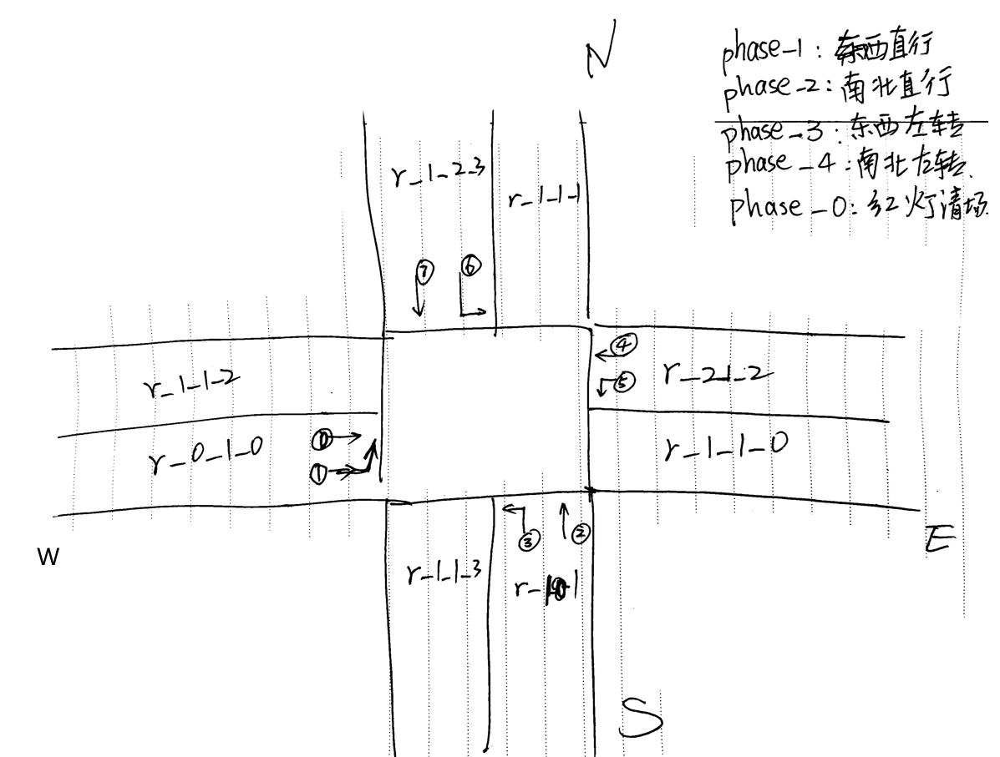
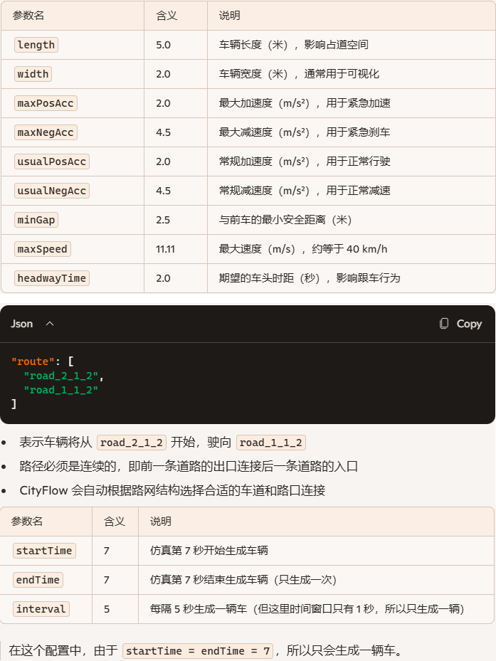
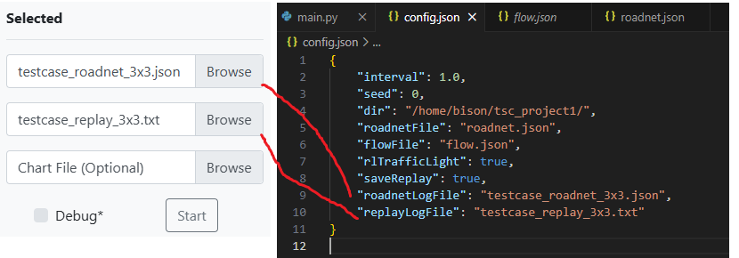

**快速学习cityflow交通灯控制模拟器**

### 1、配置的理解

安装什么的都没有太大问题，按照官网的指引做就可以了。

新手容易遇到问题的是没有一组很方便理解的配置文件，而且cityflow配置文件里的路口/road这些东西的名字都不表意，所以一开始会很抓夏。

一组正确的配置文件：

[roadnet.json](code/roadnet.json)

[flow.json](code/flow.json)

[config.json](code/config.json)

需要特别注意的是，如果外部agent不对交通灯信号做控制，就把config.jsong里的这项配置改为false，否则在可视化看回放的时候，灯不会切换。

```json
   "rlTrafficLight": true,
```


下面以上面这组配置文件为例说明关键字段的意义。

#### 1.1 路口的配置


根据 roadlinks 部分，可以得出几条road的相对位置：

```json
      "roadLinks": [
        {
          "type": "go_straight",
          "startRoad": "road_0_1_0",
          "endRoad": "road_1_1_0",
          "direction": 0,
```

而且很重要的一点：roadlinks数组中的元素下标，就是交通灯某个相位中availableRoadLinks指定的放行的links id。

例如下面的相位id为1的相位，放行的就是roadLinks数组中第0个和第4个连接，他们是 road_0_1_0 到 road_1_1_0和 road_2_1_2到road_1_1_2

```json
        "lightphases": [
          {
            "time": 5,
            "availableRoadLinks": []
          },
          {
            "time": 30,
            "availableRoadLinks": [
              0,
              4
            ]
          },
```

然后就是lightphases数组中元素的下标，就是set_tl_phase()函数第二个参数的相位编号，例如下面的代码，当编号为0的时候，按照上面的配置，就是所有方向都不放行（全红灯用来清理交叉区域）。

cityflow对于相位的时长完全由外部程序控制，函数没有时长字段，想切就切。

```python
eng = cityflow.Engine("/home/bison/tsc_project1/config.json", thread_num=1)
phase = 1
for i in range(2000):
    eng.next_step()

    if i > 0 and (i% 20) == 1: # 每20s切一次
        # 先来3s红灯清场
        eng.set_tl_phase('intersection_1_1', 0)
        for _ in range(5):
            eng.next_step()
        # 然后轮转到下一个方向放行
        phase = (phase + 1) % 4
        eng.set_tl_phase('intersection_1_1', phase+1)
```

耐心梳理，可以得到下面的这张图：



梳理出这张图特别关键，是后面的特征工程 / reward_shaping / 动作设计 工作的前置工作。

#### 1.2 车流的配置

相比之下，flow.json，车流的配置要简单很多。以其中一辆车的配置为例

```json
{
    "vehicle": {
      "length": 5.0,
      "width": 2.0,
      "maxPosAcc": 2.0,
      "maxNegAcc": 4.5,
      "usualPosAcc": 2.0,
      "usualNegAcc": 4.5,
      "minGap": 2.5,
      "maxSpeed": 11.11,
      "headwayTime": 2.0
    },
    "route": [
      "road_2_1_2",
      "road_1_1_2"
    ],
    "interval": 5,
    "startTime": 7,
    "endTime": 7
  },
```



### 2、IDE

因为cityflow只支持unix类环境，所以我把它运行在windows的wsl的ubuntu镜像里。

但我们通常希望用IDE图形化开发调试，这时候只需要用vscode + WSL插件就可以很方便和稳定的实现了。

网上资料较多，这里不展开，可以查AI或者看下面的详细说明：

```
https://code.visualstudio.com/docs/remote/wsl
```

据说pycharm也是支持WSL远程开发的。我没有尝试。

另外，由于cityflow是基于c语言开发的，所以IDE里针对cityflow包中的函数，没有语法提示和代码补齐功能。可以让AI根据cityflow的文档，生成一个.pyi文件，放在工程目录下，vscode就会有语法提示了：

```python
# cityflow.pyi

class Engine:
    def __init__(self, config_file: str, thread_num: int = 1): ...
    
    def next_step(self) -> None: ...
    def get_current_time(self) -> int: ...
    
    def get_vehicles(self, include_waiting: bool = False) -> list[str]: ...
    def get_vehicle_info(self, vehicle_id: str) -> dict: ...
    
    def get_lane_vehicle_count(self, lane_id: str) -> int: ...
    def get_lane_waiting_vehicle_count(self, lane_id: str) -> int: ...
    def get_lane_vehicles(self, lane_id: str) -> list[str]: ...
    
    def get_roadnet(self) -> dict: ...
    
    def get_tl_phase(self, intersection_id: str) -> int: ...
    def set_tl_phase(self, intersection_id: str, phase: int) -> None: ...
    
    def get_vehicle_speed(self, vehicle_id: str) -> float: ...
    def get_vehicle_distance(self, vehicle_id: str) -> float: ...
    def get_vehicle_route(self, vehicle_id: str) -> list[str]: ...

```


### 3、回放可视化

使用cityflow自带的可视化工具，这里需要记录一下踩的一个坑就是，这里第一个输入框，不是选择roadnet.json文件，而是config.json中指定的日志文件：



