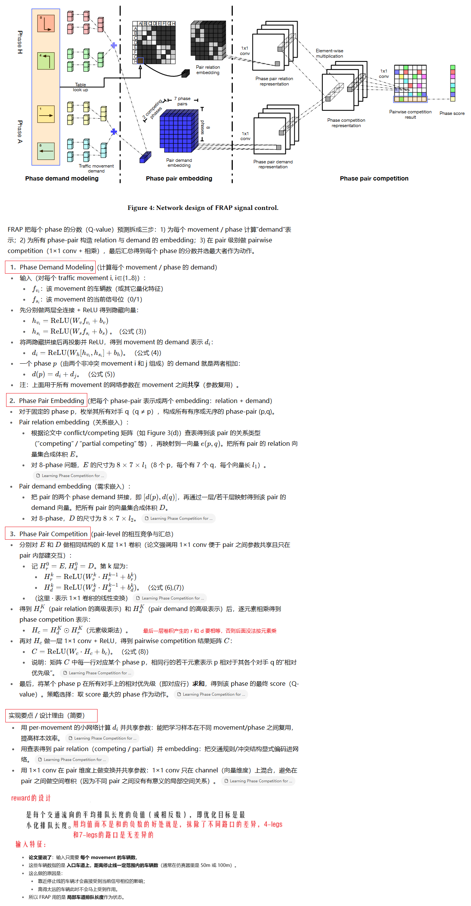

**Learning Phase Competition for Traffic Signal Control**

### 1、Introduction

有各种解决TSC问题的RL方法，他们有各式各样的奖励设计、状态描述、动作空间、RL算法。

但是由于状态空间的爆炸，RL方法难以很好的解决TSC问题。一个最典型的东西南北四向交叉路口，有8个交通灯相位，假设每个车道的车辆容量是 n，那么状态空间的大小是 8 x n^8，设 n = 32， 复杂度就是 2 ^ 43，也就是 P 级别的数量。如果每个交叉路口的结构都不同，都需要从0训练一个agent，那是非常低效的。

这么大的状态空间，如何有效和充分的探索，是一个重要挑战。实际训练的时候，大量的重复状态反复出现，大量的状态又未被探索到。

事实上，大量的状态是不需要探索的，因为他们跟其他状态是反转或者旋转的关系：


​	bison：我不太认同上面这样的计算方式，DNN是有泛化能力的，例如它学习到放行排队最长的方向，那么每个方向上车辆数量是多少就不那么重要，也就是大量的状态是同一类状态，不需要都在训练的经验里出现。人脸检测也不需要把世界上的人脸都拉过来参与训练。

如果我认同的是，仅仅依靠真实的偏短暂的车流数据来训练RL agent是不够的，因为状态样本不够丰富不够全面。例如一年中东西方向的车辆密度都比南北的大，但某一天城市举办奥运会，南北方向的车流密度远大于东西方向，那agent可能就不能很好的应对这种情况。


本论文提出了FRAP方法，它聚焦于不同交通流（traffic movement）之间的相对关系，它对翻转和旋转等对称操作是不敏感的，并考虑了所有相位配置。

FRAP就是(which is invariant to symmetric operations like **F**lip and **R**otation and considers **A**ll **P**hase configurations)中几个首字母缩写

FRAP训练的收敛速度比其他RL方法快，而且有很好的通用性，可以处理不同路口结构、不同的车流分布、复杂的相位设置、多交叉口环境。

#### 2、Related Work

介绍了TSC问题中的传统方法和基于RL的方法，作者认为他们都不能很好的处理8相位的单个路口的场景，因为探索不够。

### 3、Preliminaries

解释了TSC问题和RL方法中的基本概念

### 4、Method

FRAP方法基于Ape-X DQN框架。Ape-X DQN是一个分布式的RL学习框架，分为 acting 和learning 两部分。acting负责与环境交互，产生经验存储到replay buffer，learning负责消费replay buffer里的经验，对DQN模型进行训练。



一次前向传播的伪代码：

```python
# 假设参数定义如下：
# B: batch size
# M: number of movements per intersection (通常为 8)
# F: number of features per movement (例如车流量、信号状态等，通常为 2)
# D: hidden dimension for movement embedding
# P: number of phases (通常为 8)
# L: embedding dimension for phase pair interaction

# 输入：movement features
X = Tensor(shape=(B, M, F))  # 每个 batch 中一个 intersection 的 movement 特征

# Step 1: Movement Embedding
movement_embed = FC_Layer_1(X)        # shape: (B, M, D1)
movement_embed = ReLU(movement_embed)
movement_embed = FC_Layer_2(movement_embed)  # shape: (B, M, D)

# Step 2: Phase Embedding via Movement Aggregation
# phase_map: (P, M) → 每个 phase 包含哪些 movement（0/1）
phase_map = get_phase_to_movement_matrix()  # shape: (P, M)

# 扩展维度以进行 batch-wise矩阵乘法
phase_map_expanded = phase_map.unsqueeze(0).repeat(B, 1, 1)  # shape: (B, P, M)

# 计算每个 phase 的表示：对属于该 phase 的 movement 的 embedding 求和
phase_embed = batch_matmul(phase_map_expanded, movement_embed)  # shape: (B, P, D)

# Step 3: Phase Pair Embedding
# 构造所有 phase 对 (p, q)，p ≠ q
phase_pairs = generate_phase_pairs(P)  # [(p, q), ...]

# 初始化 pairwise embeddings
pair_demand_embed = []
pair_relation_embed = []

for (p, q) in phase_pairs:
    # 拼接两个 phase 的 demand 表示
    demand_pair = concat(phase_embed[:, p, :], phase_embed[:, q, :])  # shape: (B, 2D)
    pair_demand_embed.append(demand_pair)

    # 获取关系嵌入（例如冲突类型）
    relation_pair = get_relation_embedding(p, q)  # shape: (L,)
    relation_pair = relation_pair.unsqueeze(0).repeat(B, 1)  # shape: (B, L)
    pair_relation_embed.append(relation_pair)

# 堆叠所有 pairs
pair_demand_embed = stack(pair_demand_embed, dim=1)   # shape: (B, P*(P-1), 2D)
pair_relation_embed = stack(pair_relation_embed, dim=1)  # shape: (B, P*(P-1), L)

# Step 4: Interaction Modeling
# 分别通过 1x1 卷积或 FC 层处理
H_d = Conv1x1_demand(pair_demand_embed)     # shape: (B, P*(P-1), L)
H_r = Conv1x1_relation(pair_relation_embed) # shape: (B, P*(P-1), L)

# Element-wise multiplication
H_c = H_d * H_r  # shape: (B, P*(P-1), L)

# Step 5: Competition Score
competition_score = Conv1x1_score(H_c)  # shape: (B, P*(P-1), 1)

# Step 6: Aggregation to Q-values
# 将每个 phase 对其他 phase 的竞争得分加和
Q_values = aggregate_scores(competition_score, phase_pairs, P)  # shape: (B, P)

return Q_values

```

#### 讨论


设 n = 32， 复杂度就是 2 ^ 12，相比一开始的2 ^ 43，复杂度降低了非常多。关键是让探索更充分了。

### 5、Experiments

#### 5.1 实验设计

1. 模拟环境：SUMO，每次绿灯切换，都会插入3s的黄灯和2s的全相位红灯
2. 数据集：济南、杭州、亚特兰大共 7 个交叉路口
3. 比较方法：
   1. FixedTime
   2. SOTL
   3. Formula：按照一定的公式决定相位和计算绿灯时长
   4. DRL：栅格化的方式处理路口的车辆数
   5. IntelliLight
4. 评估指标：travel time

#### 5.2 实验结果

验证了：

1. 本身的高性能
2. 对同一个环境中翻转流量的自适应
3. 收敛比其他方法更快
4. 对不同流量的环境的自适应能力
5. 对不同结构的环境的自适应能力
6. 对多路口环境的自适应能力（我没有截图）


### 6、Conclusion

未来的工作，还需要对行人和非机动车加以考虑，使之适配真实的场景。