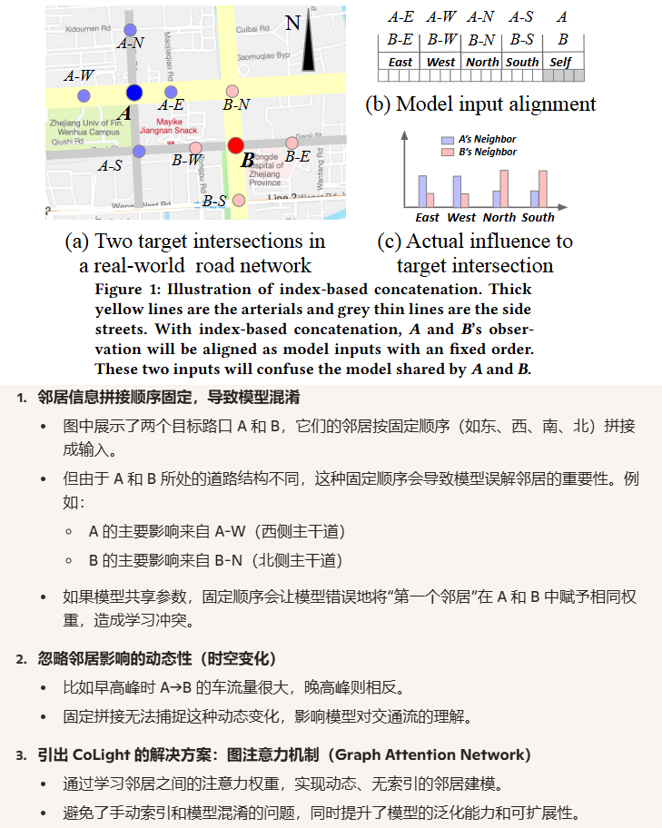
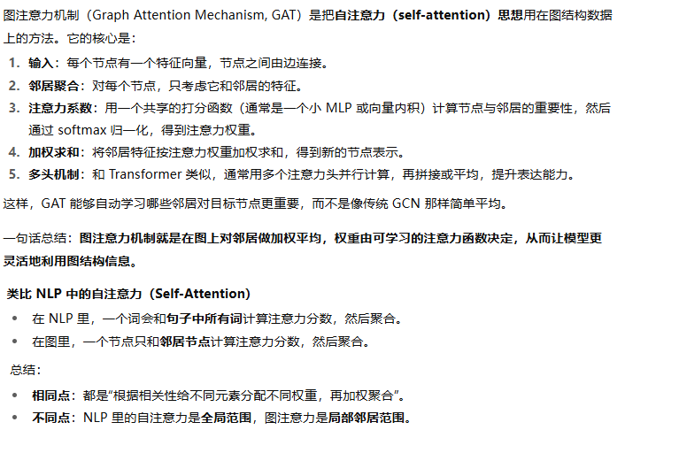
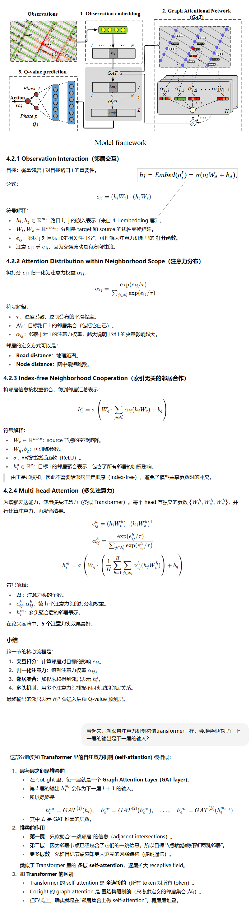
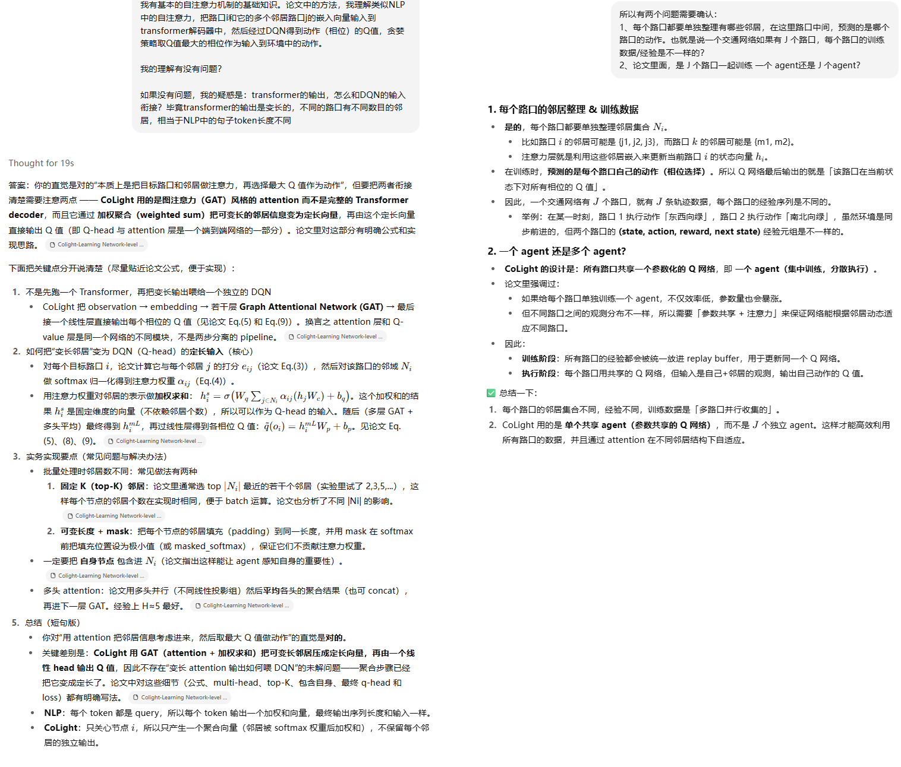
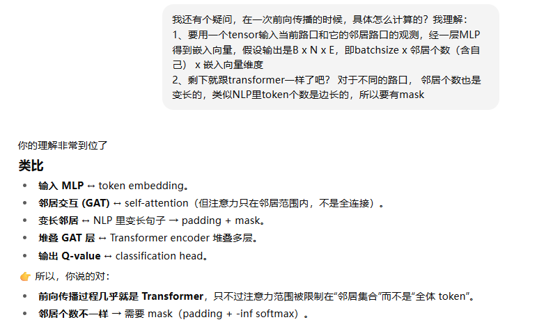
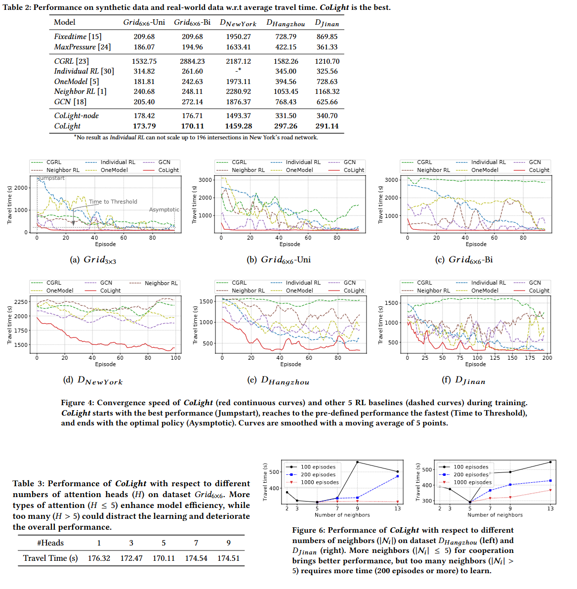
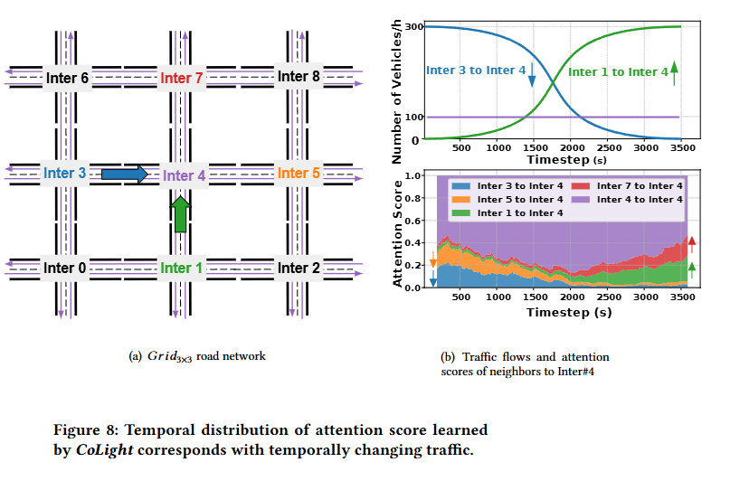

**Colight:Learning Network-level Cooperation for Traffic Signal Control**

year: 2019

venue：CIKM

### 1、Introduction

交通灯之间的协同，可以让车辆更快的通过路口，从而降低通行时间(travel time)。

本论文使用图注意力网络，促进信号灯之间的通信和协同。据我们所知，这是在TSC问题中第一个使用图注意力机制的方法。主要贡献包括：

1. 使用图注意力网络描述相邻路口之间的动态关系
2. 使用加权平均机制（weighted average mechanism）代替静态的索引方式，能更准确的描述相邻路口的影响力。并在不同的路口的agent上共享网络参数以加速训练
3. 行业内第一次在数百个路口的大规模交通网络上进行实验

### 2、Related Work

现有相邻信号灯之间协同的方案的缺点：

1. 来自不同邻居的影响是动态变化的，不应该同等对待
2. 为了拼接邻居信息，模型需要为每个路口设计一个**固定的邻居索引顺序**（如东、西、南、北），对于不同拓扑的路口缺乏通用性



图注意力机制的基本概念：



### 3、Problem Definition

把TSC问题作为一个马尔可夫决策过程（MDP）描述了相关概念，并引入了基于价值函数的RL方法

### 4、Method

#### 4.1 Observation Embedding

先是用一层MLP网络，把观测变成固定尺寸的嵌入表示

#### 4.2 Graph Attention Networks for Cooperation





#### 4.3 Q-value Prediction

就是DQN，虽然损失函数公式看起来不是，经AI澄清就是DQN

#### 4.4 Complexity Analysis

时间复杂度和空间复杂度都是 
$$
O(m^2L)
$$
其中：

1. m= embedding 维度（例如 128），不要与前面公式里多头的头数混淆
2. L= 堆叠层数（例如 2 层 GAT）。




一段伪代码辅助理解

```python
import torch
import torch.nn as nn
import torch.nn.functional as F

class CoLightGATLayer(nn.Module):
    def __init__(self, input_dim, hidden_dim, num_heads, tau=1.0):
        super().__init__()
        self.num_heads = num_heads
        self.tau = tau
        
        # 每个 head 独立的参数
        self.W_t = nn.Parameter(torch.randn(num_heads, input_dim, hidden_dim))
        self.W_s = nn.Parameter(torch.randn(num_heads, input_dim, hidden_dim))
        self.W_c = nn.Parameter(torch.randn(num_heads, input_dim, hidden_dim))
        
        self.W_q = nn.Linear(hidden_dim, hidden_dim)
        self.b_q = nn.Parameter(torch.zeros(hidden_dim))

    def forward(self, h, mask):
        """
        h: [B, N, D]  B=batch, N=邻居数(含自己, padding 后对齐), D=embedding size
        mask: [B, N]  1=有效邻居, 0=padding
        """
        B, N, D = h.shape
        H = self.num_heads
        
        outputs = []
        for head in range(H):
            # 线性变换
            h_t = torch.matmul(h, self.W_t[head])   # [B, N, d]
            h_s = torch.matmul(h, self.W_s[head])   # [B, N, d]
            h_c = torch.matmul(h, self.W_c[head])   # [B, N, d]

            # 注意力打分：target 与 source 两两计算
            # (B, N, d) x (B, d, N) -> (B, N, N)
            scores = torch.matmul(h_t, h_s.transpose(1, 2)) / self.tau

            # mask 无效邻居：置 -inf
            mask_expand = mask.unsqueeze(1).expand(B, N, N)  # [B, N, N]
            scores = scores.masked_fill(mask_expand == 0, float("-inf"))

            # softmax 得到注意力权重
            alpha = F.softmax(scores, dim=-1)  # [B, N, N]

            # 聚合邻居表示
            h_new = torch.matmul(alpha, h_c)   # [B, N, d]
            h_new = self.W_q(h_new) + self.b_q
            h_new = F.relu(h_new)
            outputs.append(h_new)

        # 多头聚合 (平均)
        h_out = torch.stack(outputs, dim=0).mean(dim=0)  # [B, N, d]
        return h_out


class CoLightNet(nn.Module):
    def __init__(self, obs_dim, embed_dim, hidden_dim, num_heads, num_layers, num_actions):
        super().__init__()
        self.embed = nn.Linear(obs_dim, embed_dim)
        self.gat_layers = nn.ModuleList([
            CoLightGATLayer(embed_dim if l == 0 else hidden_dim,
                            hidden_dim, num_heads) for l in range(num_layers)
        ])
        self.q_head = nn.Linear(hidden_dim, num_actions)

    def forward(self, obs, mask):
        """
        obs:  [B, N, obs_dim]  各路口观测 (含邻居)
        mask: [B, N]           邻居有效性 (1=有效,0=padding)
        """
        h = F.relu(self.embed(obs))  # [B, N, embed_dim]

        for gat in self.gat_layers:
            h = gat(h, mask)  # [B, N, hidden_dim]

        # 只取目标路口（假设 index=0 是自己，其余是邻居）
        h_target = h[:, 0, :]  # [B, hidden_dim]

        q_values = self.q_head(h_target)  # [B, num_actions]
        return q_values

```


### 5、Experiments

#### 5.1 实验设计

1. 模拟环境：CityFlow。每次切换会插入3s黄灯和2s全方向红灯
2. 数据集：曼哈顿、杭州、济南
3. 比较方法：
   1. FixedTime
   2. MaxPressure
   3. CGRL：也是一个面向多路口的协同RL方法
   4. Intellilight：面向单个路口的RL方法
   5. OneModel
   6. Neighbor  RL
   7. GCN： 一个使用图卷积神经网络的RL方法
   8. CoLight
   9. CoLight-node：变种，使用路口间的距离来定义邻居范围
4. 评估指标
   1. 平均通行时间（average travel time）：It calculates the average travel time of all the vehicles spend between entering and leaving the area (in seconds)

#### 5.2 实验结果



### 6、Attention Study

论文这部分专门研究了注意力机制到底有多好的协同了邻居信号灯。详细见论文，我这里只截取时间维度的变化情况：



### 7、Conclusion

未来研究的方向：

1. 邻居范围的确定更灵活
2. 输入特征更丰富。当前只用了各个路口的（当前相位、每个车道上的车辆数）

### 8、源代码

[这里](https://github.com/wingsweihua/colight)