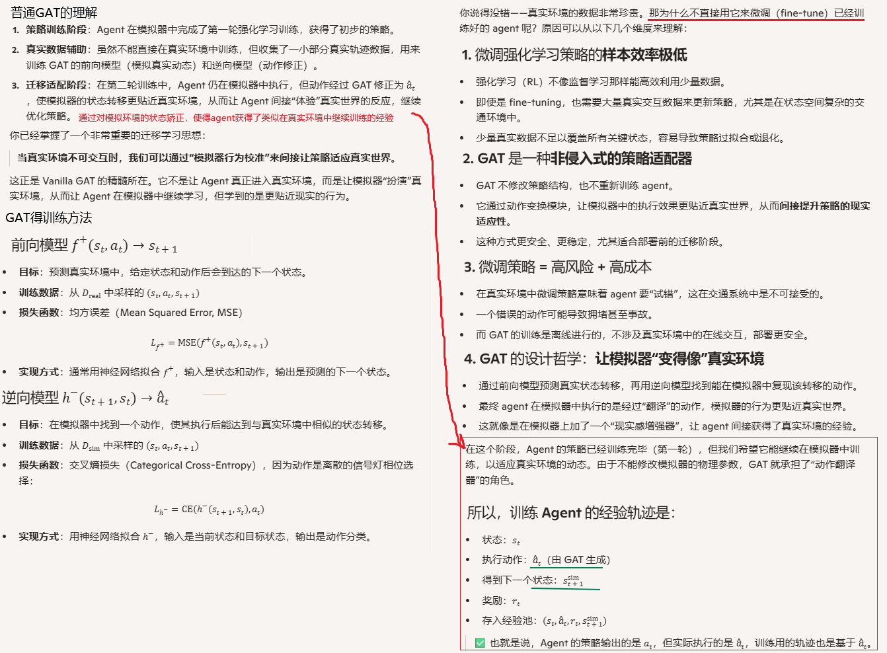
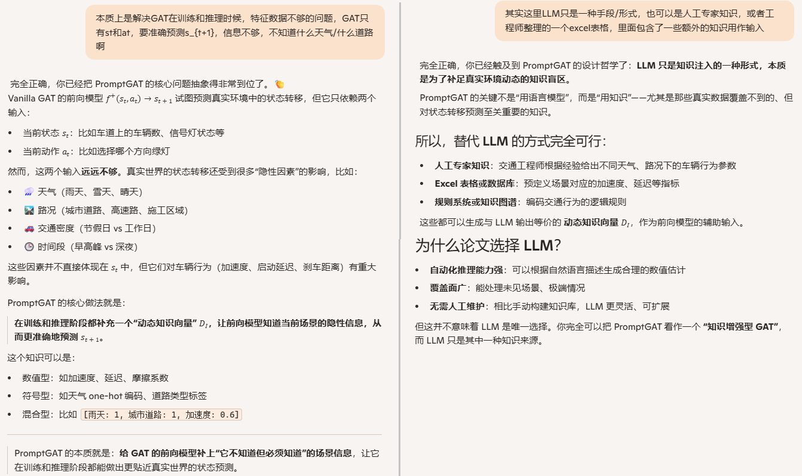
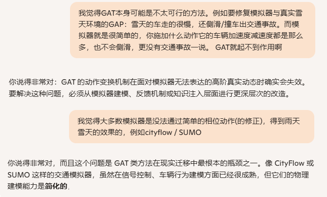
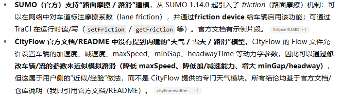
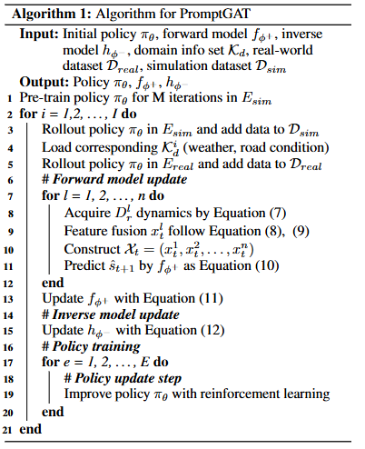
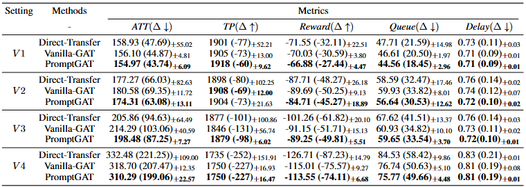

**Prompt to Transfer Sim-to-Real Transfer for Traffic Signal Control with Prompt Learning**

venue：AAAI

year：2024

### 1、Introduction

#### 1.1 理解Grounded Action Transformation(GAT)

GAT是解决模拟器环境与真实环境的GAP的一个方案，是模拟环境和真实环境之间的一个桥梁和矫正器

#### 1.2 PromptGAT的原理

### 2、Related Work

介绍了sim2real迁移的gap修复的一些业内方法。

CityFlow / SUMO的支持情况，AI回答：

### 3、Method

### 4、Experiments

#### 4.1 实验设计

1. 真实环境：SUMO
2. 模拟环境：CityFlow，为了让CityFlow支持GAT，作者团队开发了LibSignal（an open-source framework that incorporates multiple simulation environments）
3. 评估指标：真实环境/模拟环境的平均通行时间 / 延迟 /吞吐两 / 队列长度的**差值**

#### 4.2 实验结果

### 5、Conclusion

### 6、我的疑问

疑问：我很好奇论文里用SUMO作为真实环境、cityflow做模拟环境。cityflow是怎么可能通过一个特殊的动作a_hat来实现车辆加速慢、间隔远的状态的