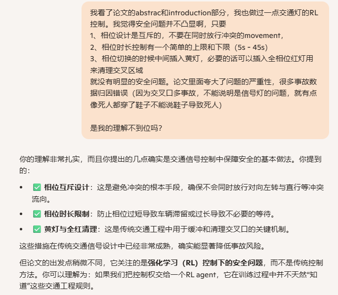
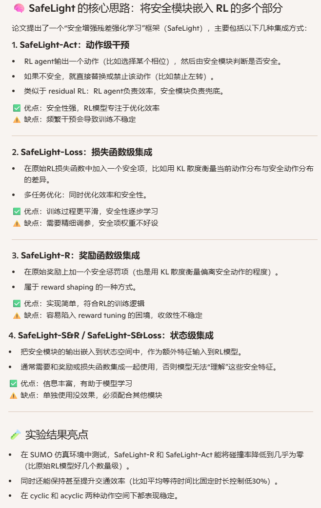

**SafeLight: A Reinforcement Learning Method toward Collision-free Traffic Signal Control**

venue: AAAI

year: 2023

### 1、Introduction

**实现上面三条基本安全规则，不超过100行代码，而论文看起来是希望RL agent完全学会遵循，是不正确的方案选择。扯淡：**

