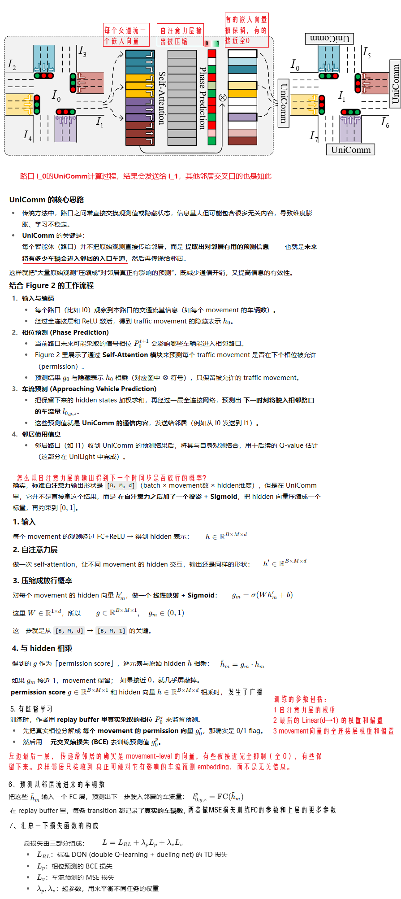
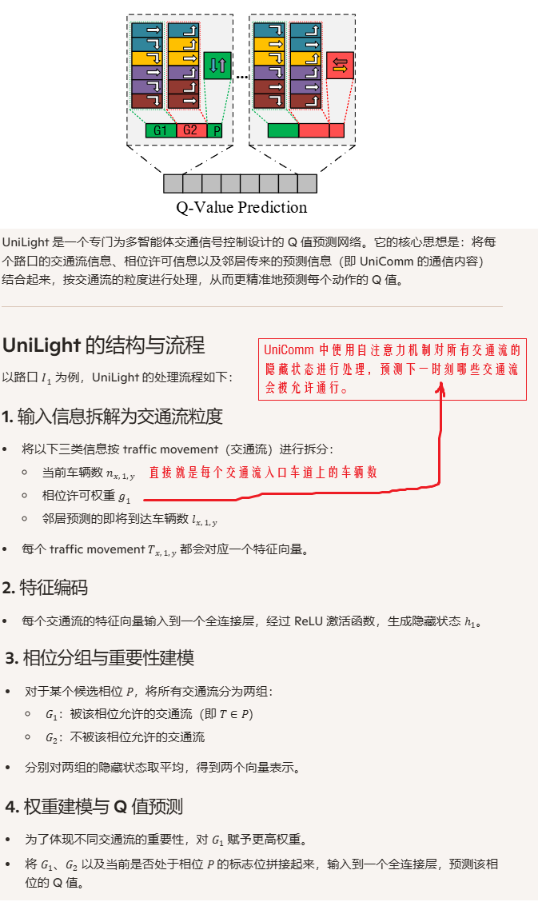
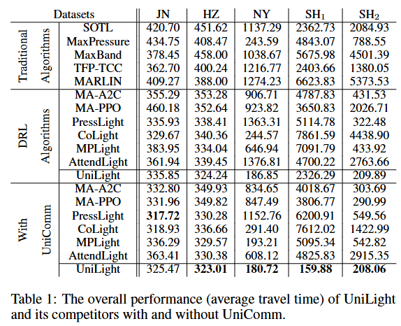

**Multi-Agent Reinforcement Learning for Traffic Signal Control through Universal Communication Method**

venue：IJCAI

year：2022

### 1、Introduction

论文针对 MultiAgent下相邻路口间信息通信/共享的问题，提出了：

1. 一种通用的可以结合各类MultiAgent方法的通信方式，UniComm
2. 一种使用UniComm、基于movement重要性的RL方法：UniLight
3. 通过实验证明UniComm具备通用性、UniLight对于复杂的交通情况也具备性能优势

### 2、Related Work

介绍了业界单个交叉口的信号灯控制问题、多个交叉口的信号灯问题的相关工作

### 3、Problem Definition

TSC问题种的各类定义：交叉口、road、phase、traffic movement、vehicle route、

### 4、Method

#### 4.1 UniComm

#### 4.2 UniLight

### 5、Experiments

实验设计：

1. 环境：cityflow
2. 数据集：杭州、济南、上海、纽约
3. 比较算法：见结果表格
4. 评估指标：平均通行时间

实验结果

### 6、Conclusion

我们提出了一种通用的相邻信号灯数据协同的方法，UniComm，还提出了一种基于UniComm的RL方法，UniLight，实验证明他们效果显著。