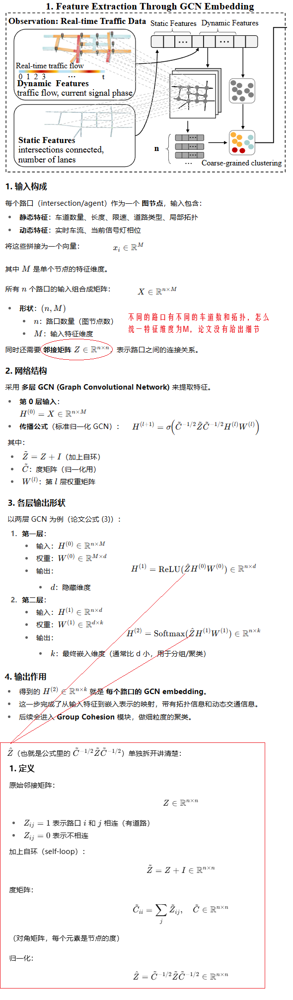
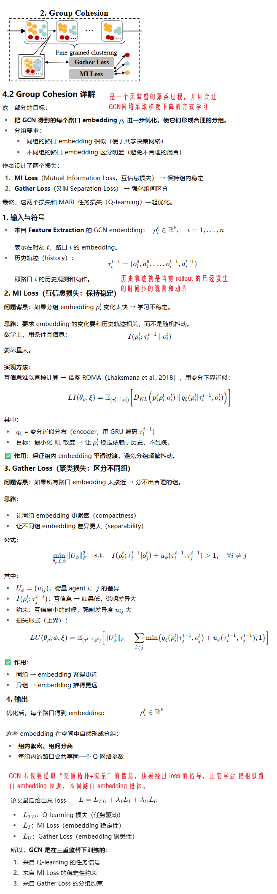
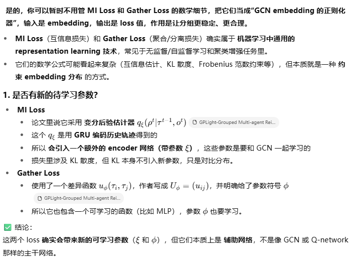
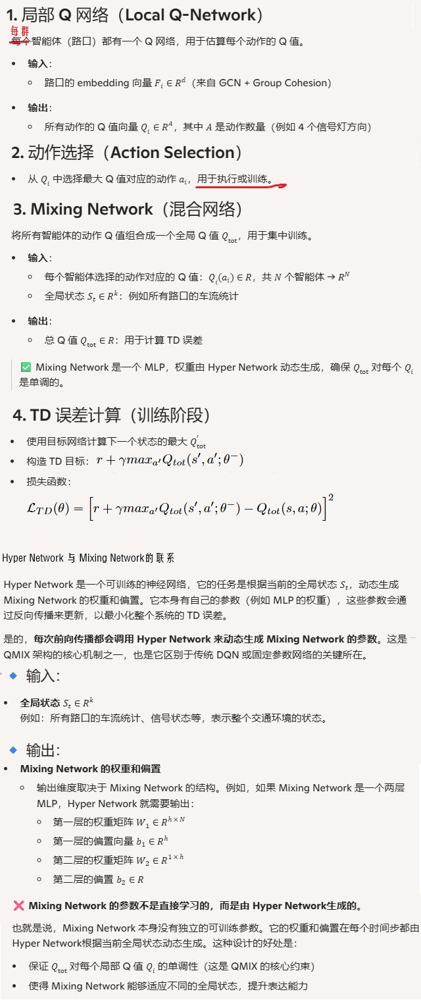
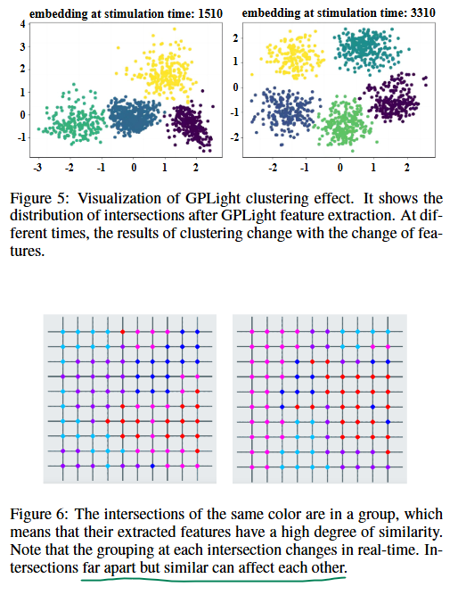
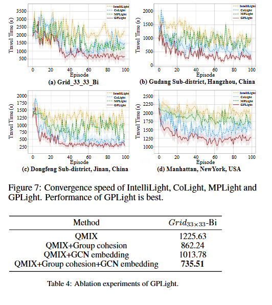

**GPLight-Grouped Multi-agent Reinforcement Learning for Large-scale Traffic Signal Control**

venue：IJCAI

year：2023

### 1、Introduction

### 4、The Proposed Model: GPLight

#### 4.1 Feature Extraction

#### 4.2 Group Cohesion

##### 关于MI Loss和Gather Loss的理解

### 4.3 Q-Learning

### 5、Experiments

#### 5.1 实验设置

1. 模拟器：CityFlow。每次切换，会插入3s黄灯和2s全方向的红灯
2. 数据集：人造数据集（10x10， 33x33）和真实的杭州、济南、纽约红绿灯数据
3. 比较方法：
   1. FixedTime
   2. MaxPressure
   3. IntelliLight
   4. CoLight
   5. MPLight
4. 评估指标：平均通行时间， the average time taken by all vehicles during their journey

#### 5.2 实验结果

验证聚类的效果：

整体性能和消融实验

### 6、Conclusion

本论文把相似拓扑和相似动态流量的路口进行聚类，对同一类路口训练一个agent，这样平衡了精确性和复杂度。

未来的研究方向：

1. 处理异构路口
2. 为分组智能体设计专门的 MARL 算法

