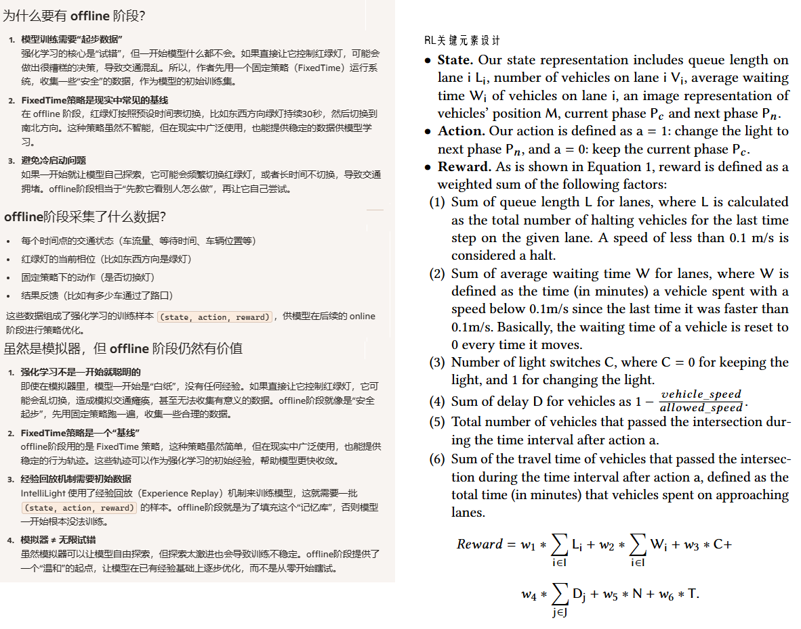
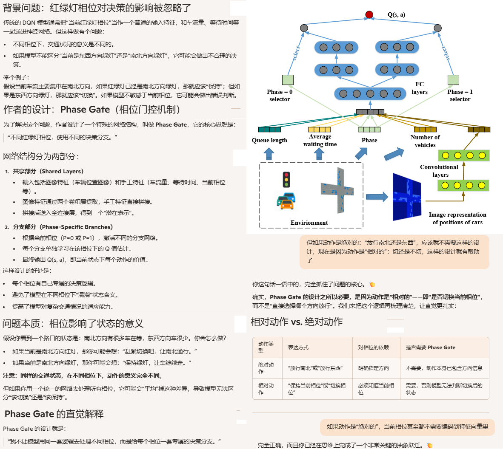
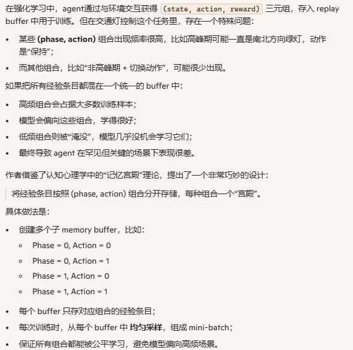
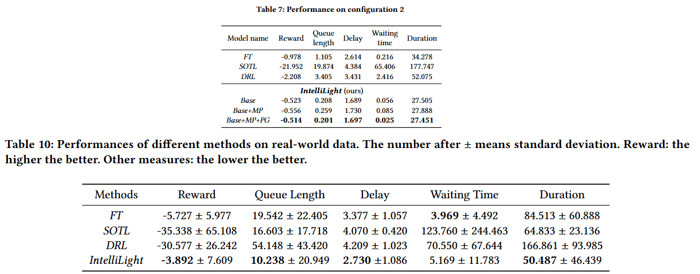

**IntelliLight-a Reinforcement Learning Approach for Intelligent Traffic Light Control**

venue:KDD

year:2018

### 1、Introduction

本论文的贡献：

1. 使用真实的数据进行实验，此前行业内没有人这么做
2. 不只是看结果，还分析为什么
3. 更聪明的相位门控设计

### 2、Related Work

### 3、Problem Definition

把问题简化得没有左转相位了？ 我觉得这个完全损害了问题的完整性，不是一个有价值的研究问题了。

### 4、Method

#### 网络架构设计：

#### Memory Palace and Model Updating

rollout出来的经验条目，按照不同的 (phase, action)组合，出现频率不一样，也就是样本不均衡。如果放在一个replay buffer里，那么高频率样本就会占优势，导致低频率样本没有被充分学习，agent应对低频率的场景性能会很差。

Memory Palace的思想就是把这些样本分开存放，均匀的抽样样本。

### 5、Experiments

#### 实验设计

1. 模拟器：SUMO
2. 评估指标：平均奖励、平均队列长度、平均延迟（延迟是指车辆实际速度与允许速度之间的差距）、平均等待时间（速度低于 0.1m/s 的时间段）、平均通行时长（从进入路口到通过路口所花的时间）
3. 比较方法：
   1. FixedTime
   2. SOTL
   3. DRL: Specifically, it solely relies on the original traffic information as an image
   4. IntelliLight(Base)
   5. IntelliLight(with Memory Palace)
   6. IntelliLight(with Memory Palace + Phase Gate)
4. 数据集：人造数据集（configure 1 / 2 / 3 / 4） + 济南真实数据

#### 实验结果

### 6、 Conclusion

未来方向：

1. 从两个相位扩展到更多的相位，以复合实际情况
2. 从单路口扩展到多路口协同
3. 训练和测试在模拟器中，希望未来能在实际环境中部署

### 7、开放代码

[这里](https://github.com/wingsweihua/IntelliLight)