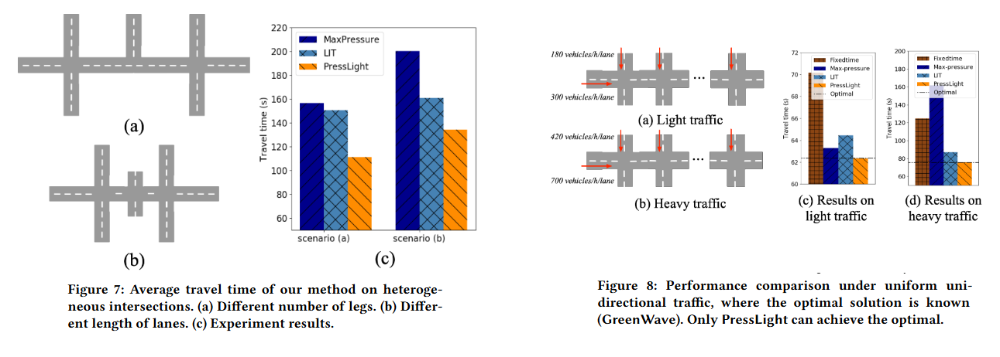

**PressLight-Learning Max Pressure Control to Coordinate Traffic Signals in Arterial Network**

venue: KDD

year: 2019

### 1、Introduction

RL的reward和输入state的设计，对agent性能和训练速度影响非常明显。输入state也不是信息越多越好，state的设计与reward的设计有关。

bison觉得Max Pressure算法明显不能最大化吞吐量：

1. Case B里，南边车道上的4辆车的位置 、车道长度、南边下面可能存在红绿灯的相位都会很大程度上影响决策。如果四辆车没有充满南边车道，那完全可以切 N->S的绿灯
2. Case B， 南边的车道上如果是2台车，而不是4台车呢，根据Max Pressure算法会选择 E->W方向绿灯，明显不是最优的动作

本论文的贡献：

1. 提出了一种基于深度强化学习的多路口干道交通信号控制方法 PressLight
   1. 将 Max Pressure 理论融入奖励与状态设计
   2. 通过理论证明该奖励等价于最大化网络吞吐、最小化旅行时间
2. 在合成和真实数据上进行大规模实验，结果显著优于：
   1. 传统方法（FixedTime、Green Wave、Max Pressure）
   2. 现有深度 RL 方法（LIT、GRL）
3. 实现了单交叉口去中心化智能体在干道上的自动协调，无需预设相位偏移或全局通信，自发形成“绿波”效果

### 2、Related Work

介绍了TSC问题中的传统方法、RL方法

### 3、Preliminaries

TSC中的一些定义/概念，例如入口车道、出口车道、交通流、相位、交通流的压力、路口的压力

**本文中的压力，和Max Pressure论文里的压力（Figure 2）还不太一样**：

### 4、Method

### 5、JUSTIFICATION OF RL AGENT 

设计的合理性证明

先忽略，不是太重要

### 6、Experiments

实验设计：

1. 模拟器：CityFlow。每次切换，会插入 5s 长的黄灯和红灯相位来清空交叉区域
2. 数据集：人造数据（分高峰/平峰期）  + 来自济南/纽约的真实数据，多个交通灯形成的路网
3. 评价指标：平均通行时间，which is calculated as the average travel time of all vehicles spent in the system.
4. 比较的方法（3个传统方法，2个RL方法）：
   1. FixedTime
   2. GreenWave：一种经典的传统多路口协同控制方法
   3. MaxPressure：which greedily chooses the phase with the maximum pressure
   4. LIT： 单路口的RL方法。This method does not consider the traffic condition on downstream lanes in state and uses a reward with queue length.
   5. GRL：多路口协同RL方法

**实验结果**

1. **我们的方法性能最好**
2. **我们的state设计加入到LIT方法里后，也提升了LIT的性能。但PressLight性能远超他们，因为reward设计更好**
3. **reward和ATT是一致的**

多路口场景下的分析：

### 7、Conclusion

1. 提出了一种基于深度强化学习的多路口干道交通信号控制方法 PressLight
   1. 将 Max Pressure 理论融入奖励与状态设计
   2. 通过理论证明该奖励等价于最大化网络吞吐、最小化旅行时间
2. 在合成和真实数据上进行大规模实验，结果显著优于：
   1. 传统方法（FixedTime、Green Wave、Max Pressure）
   2. 现有深度 RL 方法（LIT、GRL）
3. 实现了单交叉口去中心化智能体在干道上的自动协调，无需预设相位偏移或全局通信，自发形成“绿波”效果
4. 方法局限与未来方向：
   1.  当前未建模车辆动态路由行为，真实世界中车辆策略会随信号变化
   2. 在线部署存在高试错成本和安全风险
   3. 后续可引入车辆行为模型、提升学习效率与部署安全性

### 8、代码

[作者开放了代码和数据集](https://github.com/wingsweihua/presslight)