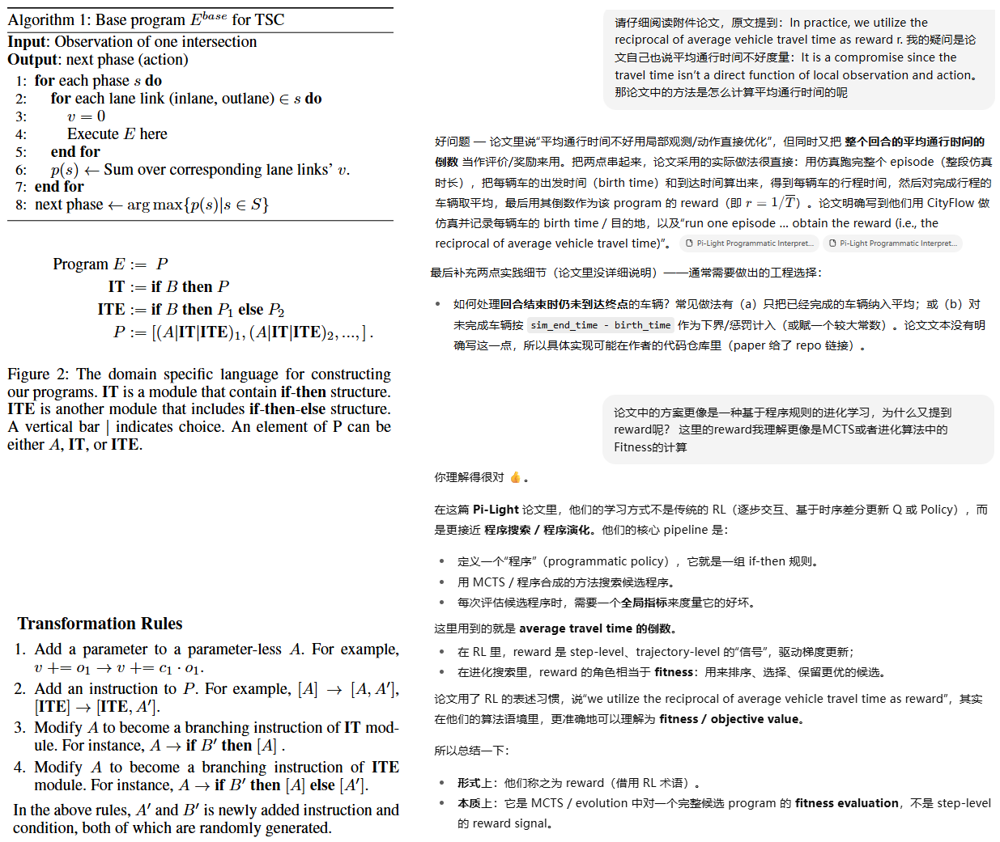
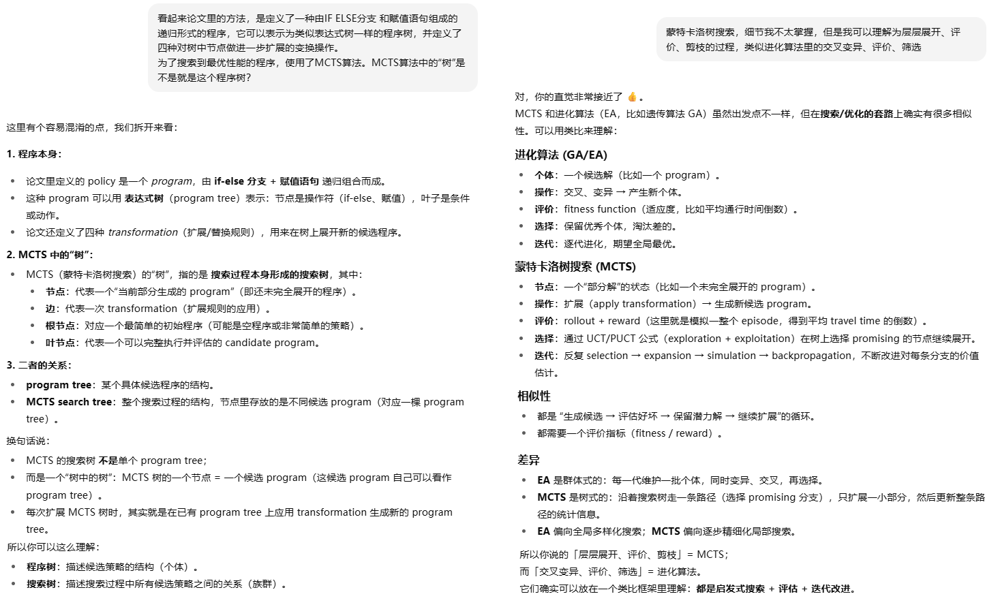
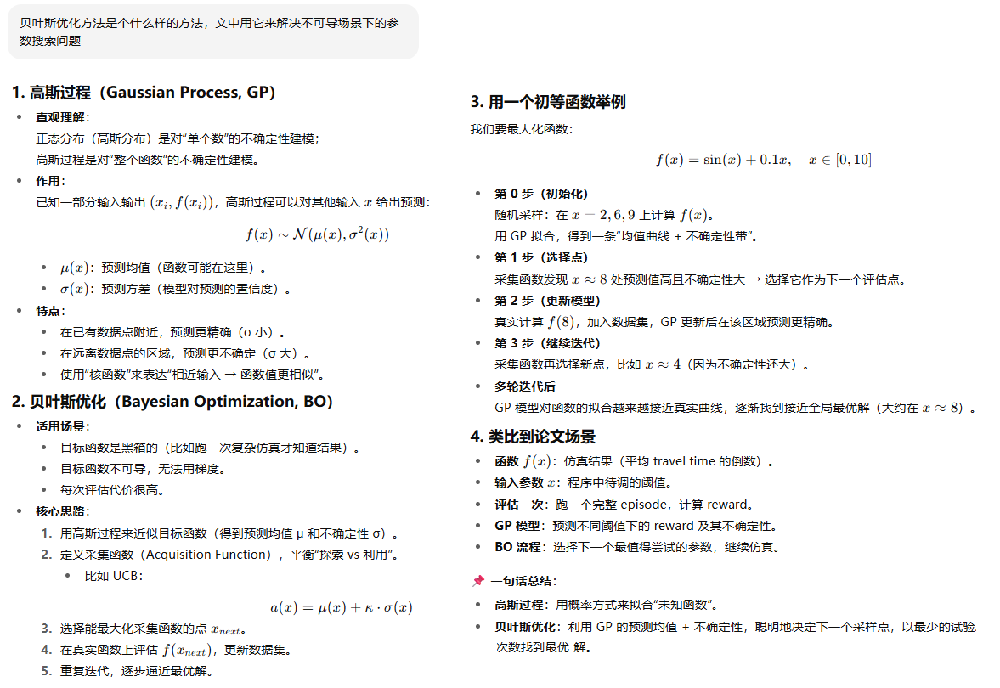
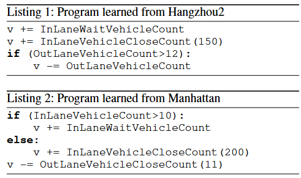
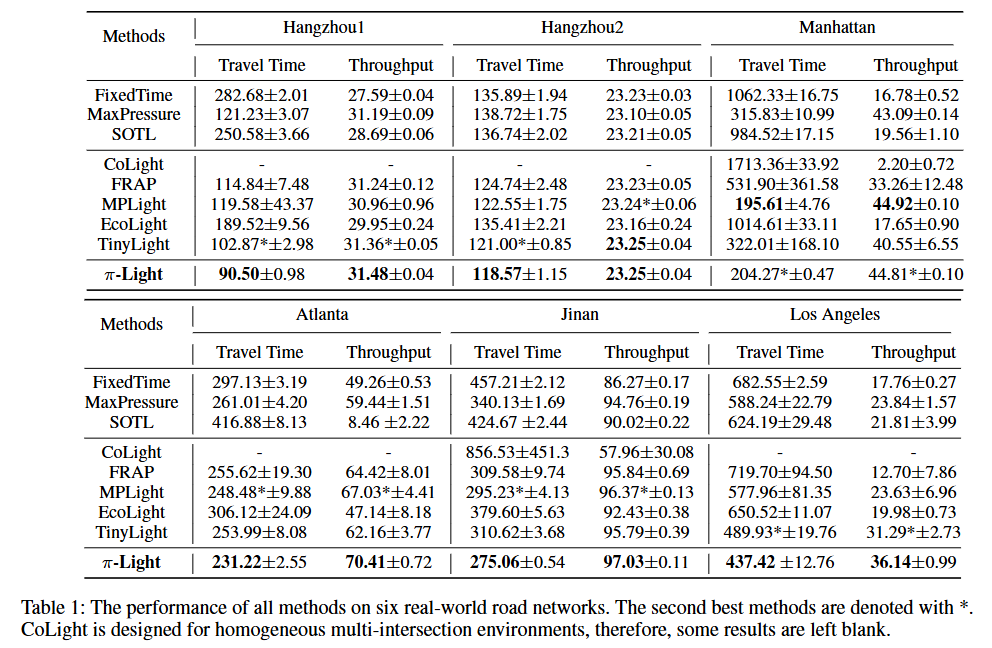
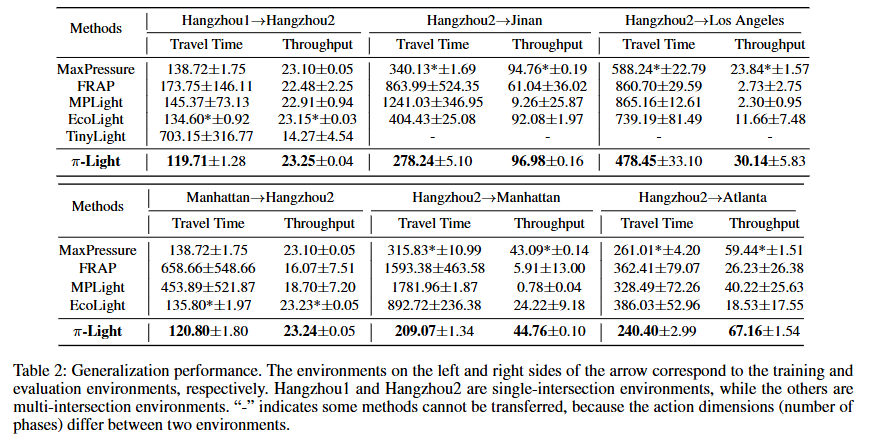
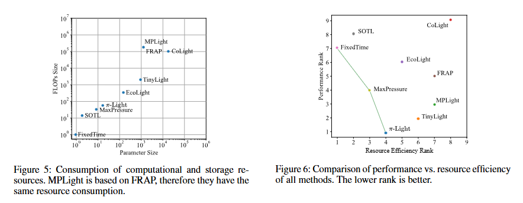
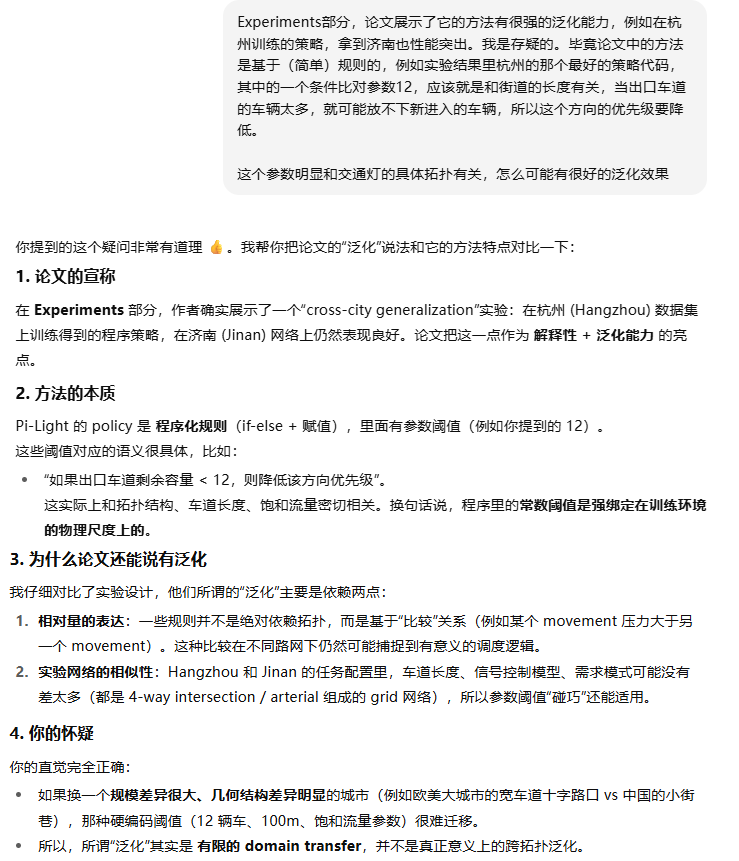

**Pi-Light Programmatic Interpretable Reinforcement Learning for Resource-Limited Traffic Signal Control**

venue：AAAI

year：2024

### 1、Introduction

DRL的TSC方法有下面几个问题：

1. 缺乏可解释性、难以验证
2. 与边缘计算的设备不兼容（例如计算性能要求太高）
3. 泛化能力不好，当地理位置、天气等外部条件发生变化，就会导致不适配。在显示世界里，为每个交通灯单独收集数据并训练是不可行的。

这导致即使在发达国家，智能交通灯的普及率也不足5%。

本论文尝试解决上面的问题，贡献有：

1. 用一种领域专门的编程语言（DSL）编写程序来描述/拟合 agent的策略，这样就具备很好的可解释性，并且适配资源受限的边缘设备
2. 引入了一种基于蒙特卡洛树搜索的框架来自动搜索 TSC程序
3. 大量的实验证明我们的方法（Pi-Light）性能超过了行业内的DRL方法，而且展现出很好的泛化能力，一次训练，到处部署

### 2、Related Work

介绍了业界用DRL解决TSC问题的各种研究，并介绍了各个领域（不只是TSC）在DNN可解释方面的一些办法：

1. 直接训练决策树、程序来表达策略
2. 从训练好的DNN中蒸馏出程序型策略
3. 训练决策树来模仿DNN策略，因为是基于模仿学习，其性能不可能超过它学习的DNN策略

本论文的方法是直接学习编程程序

### 3、Traffic Term Definition

介绍了相位、movement、压力等概念

### 4、Pi-Light Method

#### 4.1 Overview

1. 策略是基于高级的领域专属的编程语言，它会基于观测（后面有说）计算每个movement的优先级，然后进一步计算每个相位的优先级，选择优先级最高的相位作为下一个相位
2. 我们的策略是在一个交叉口训练好，部署到所有的交叉口。
3. 观测的字段包括每个车道的车辆数、每个车道的等待车辆数、每个车道停止线 x 米范围内的车辆数，这些都是现实中特别方便采集的数据。作为程序的输入参数。这里的每个车道包括入口车道和出口车道。
4. 我们使用平均车辆通行时间的倒数作为奖励

#### 4.2 Programming Languages for Policies

是一种由 if-else 分支 和 赋值语句组成的代码，层层递归定义，可以不断使用变换操作把它展开。可以表示为一种类似表达式树的形式

#### 4.3 Transformation Rules

定义了对程序树中一个节点可能的进一步展开的变换操作：

#### 4.4 什么是贝叶斯优化

### 5、Experiments

#### 实验设计：

1. 模拟器：CityFlow
2. 数据集：来自5个城市的6个交通网络的实际数据：杭州、济南、曼哈顿、洛杉矶、亚特兰大
3. 评价指标：平均通行时间、吞吐量
4. 比较方法：
   1. FixedTime
   2. SOTL
   3. MaxPressure
   4. CoLight
   5. FRAP
   6. MPLight
   7. EcoLight
   8. TinyLight

后面两个是有实际部署的轻量级方法

#### 实验结果：

##### 学习到的程序举例：

##### 基本性能对比

##### 泛化能力对比：

##### 计算资源开销对比：

### 6、Conclusion

本论文提出的 π-Light方法解决了三个挑战：可解释性、泛化能力、低配的计算资源。我们使用了领域特定的编程语言，并使用MCTS找到最优的程序，并使用贝叶斯优化方法来优化相关参数。

### 7、我的疑问

### 8、代码开放

[在这里](https://github.com/firepd/PI-Light)

