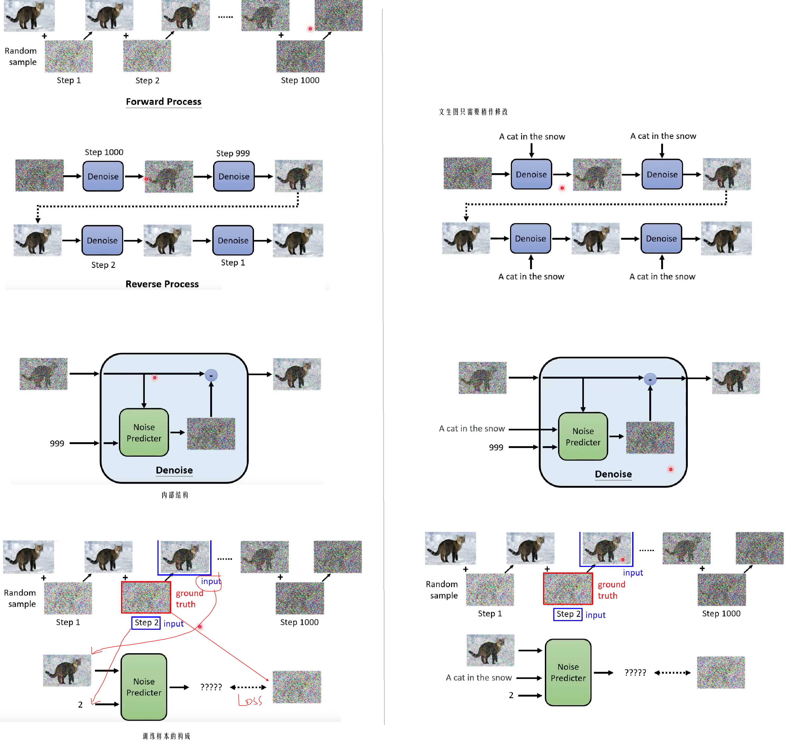
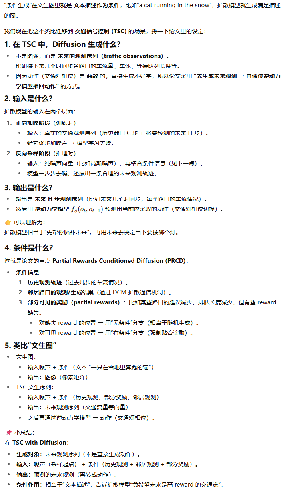
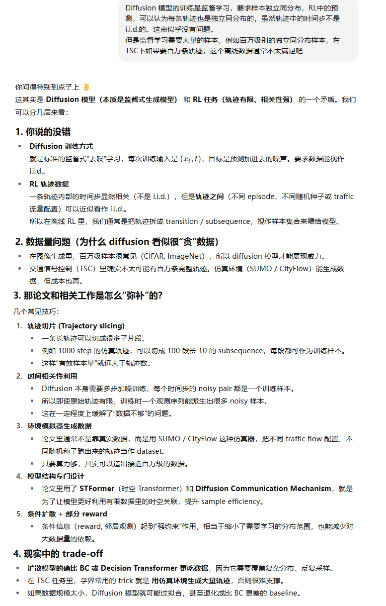
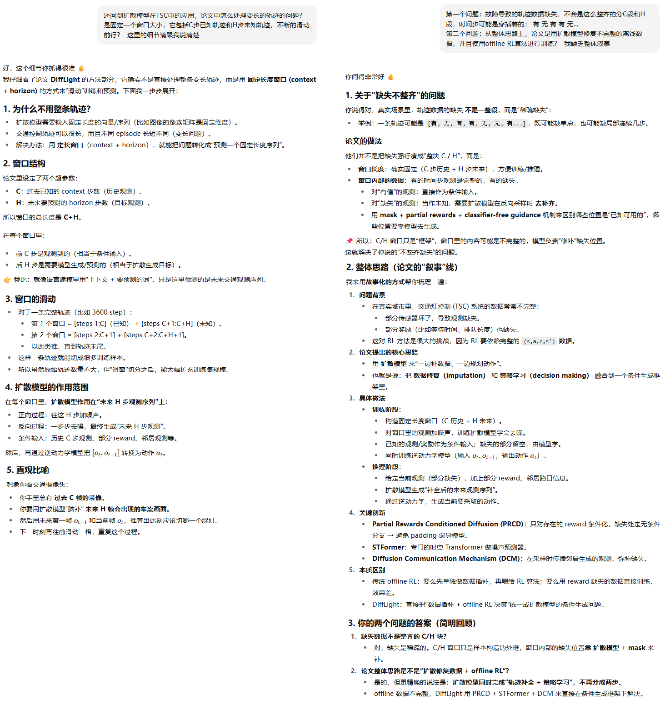
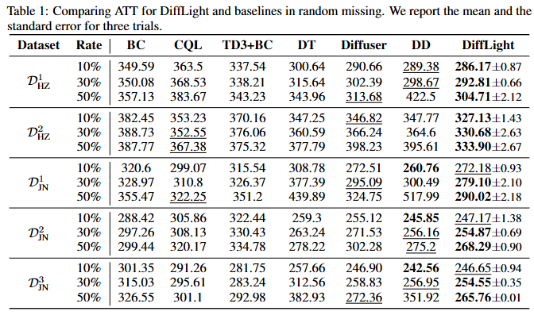

**DiffLight-A Partial Rewards Conditioned Diffusion Model for Traffic Signal Control with Missing Data**

venue: NeurIPS

year: 2024

### 1、Introduction

本论文的DiffLight方法解决下面的问题：

1. 现实情况下，由于预算不足或者传感器失效，数据不完整是常态
2. 在线训练需要频繁和环境交互，DiffLight 使用offline数据进行训练，对确实的数据做插补然后基于此做决策，是一种更可行的方式
3. 我们使用有很强的生成能力的扩散模型，并且把数据插补和决策制定两个子任务统一在一起

过程中有些挑战要克服：

1. 由于数据缺失，reward经常不可用，而插补的数据又可能造成干扰反而使性能下降
2. 只依赖本路口的观测数据，无法对跨路口的动态交通信息进行捕捉，不能在整体层面得到最优解

本论文的贡献：

1. 提出了DiffLight模型，它可以应对数据缺失情况下的TSC问题
2. 提出了以部分奖励为条件的扩散模型（PRCD），用于数据插补和决策，避免reward缺失影响学习过程
3. 设计了一种噪音模型：STFormer，用于捕捉交通灯之间的时空依赖
4. 提出了扩散通信机制（DCM），存进交通网络总的时空依赖信息的捕捉和通信
5. 大量的实验显示在数据缺失场景下，DiffLight很有竞争力

### 2、Preliminaries

#### 2.1 Diffusion Model

李宏毅老师的课程截图：

### 3 Method

比较复杂，通过与AI反复讨论，了解了一二。

### 4、Experiments

#### 4.1 实验设计

1. 模拟器：CityFlow
2. 数据集：基于杭州、济南的交通数据，先跑仿真（用某种 agent / 策略，不一定是最优的），得到完整轨迹，然后再人为抹掉部分观测/奖励，得到缺失数据集。
3. 评估指标：平均通行时间
4. 比较方法，包括一些常见的offline RL方法：BC, CQL, TD3+BC, Decision Transformer, Diffuser, Decision Diffuser

#### 4.2 实验结果

更详细更多实验数据见原论文

### 5、Related Work

介绍了TSC问题、Diffusion-based Reinforcement Learning、Traffic Data Imputation三个领域的行业内工作

### 6、Conclusion

未来的工作继续研究数据缺失情况下的TSC问题，包括：

1. 探索更多数据缺失的模式，而不只是andom missing and kriging missing
2. 探索更多的数据插补方法

### 开放代码

[在这里](https://github.com/lokol5579/DiffLight-release)

