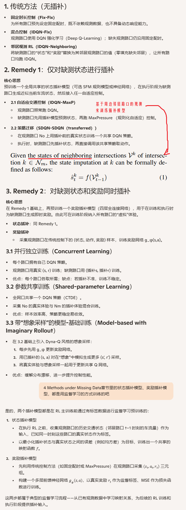
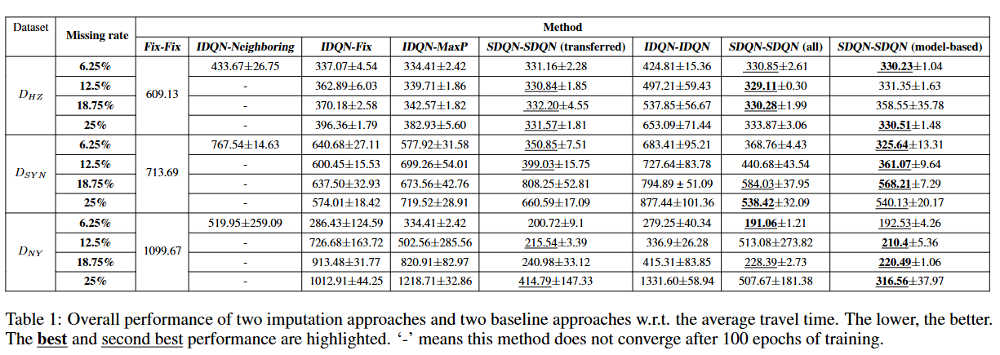

**Reinforcement Learning Approaches for Traffic Signal Control under Missing Data**

venue: IJCAI

year: 2023

### 1、Introduction

数据缺失在TSC问题的实际情况中是常见的，这使得RL方法不能实施。本论文尝试解决这个问题，贡献有：

1. 是第一个在数据缺失场景下应用RL TSC方法的。我们提出了先插补然后再训练RL agent的两步法。该方法比只在数据不缺失路口上训练的agent的性能要更好，也比传统的预定时控制方法性能更好
2. 我们在【人工合成的数据和真实世界的数据中 x 不同比例的数据缺失 x 是否有相邻不可观测路口 】的组合环境下实验表明：我们的方法比传统的预定时控制方法性能更好，在现实场景中有效。

### 2、Related Work

介绍了各种RL方法在TSC领域的应用、交通数据的插补方法（例如训练RNN /GAN网络的方式）、ModelBased RL方法（通常会训练一个reward模型和转移模型）

### 3、Preliminaries

解释了TSC问题中应用RL方法的相关概念

### 4、Method

### 5、Experiments

#### 5.1 实验设置

1. 模拟器：CityFlow
2. 数据集：人工合成数据、杭州的实际数据、纽约的实际数据
3. 比较方法：
   1. 传统方法1 Fix-Fix：This is a ruled-based method with fixed timings for all phases.
   2. 传统方法2 IDQN-Fix：Observed intersections use their own DQN and Unobserved intersections use fine-tuned fixed timings
   3. 传统方法3 IDQN-Neighboring: Both use DQN, Unobserved intersections take states and rewards from neighboring intersections
   4. 论文提出的方法的各种变形
4. 评估指标：平均通行时间

#### 5.2 实验结果

### 6、Conclusion and Future Work

未来可以探索的工作：

1. 不同的插补方法，提高准确率
2. 结合其他外部数据例如车辆速度让插补更准确