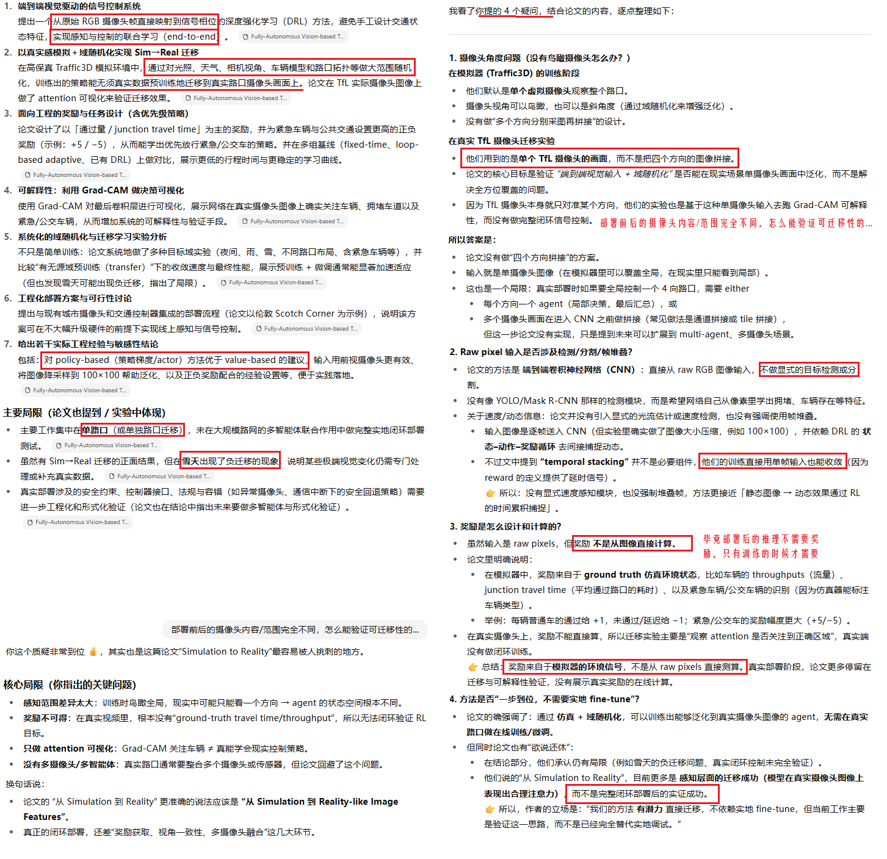
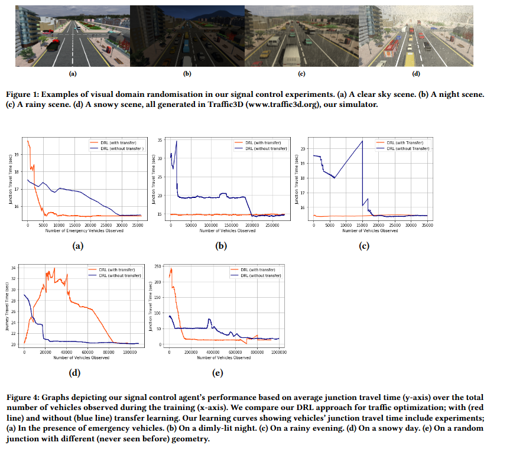
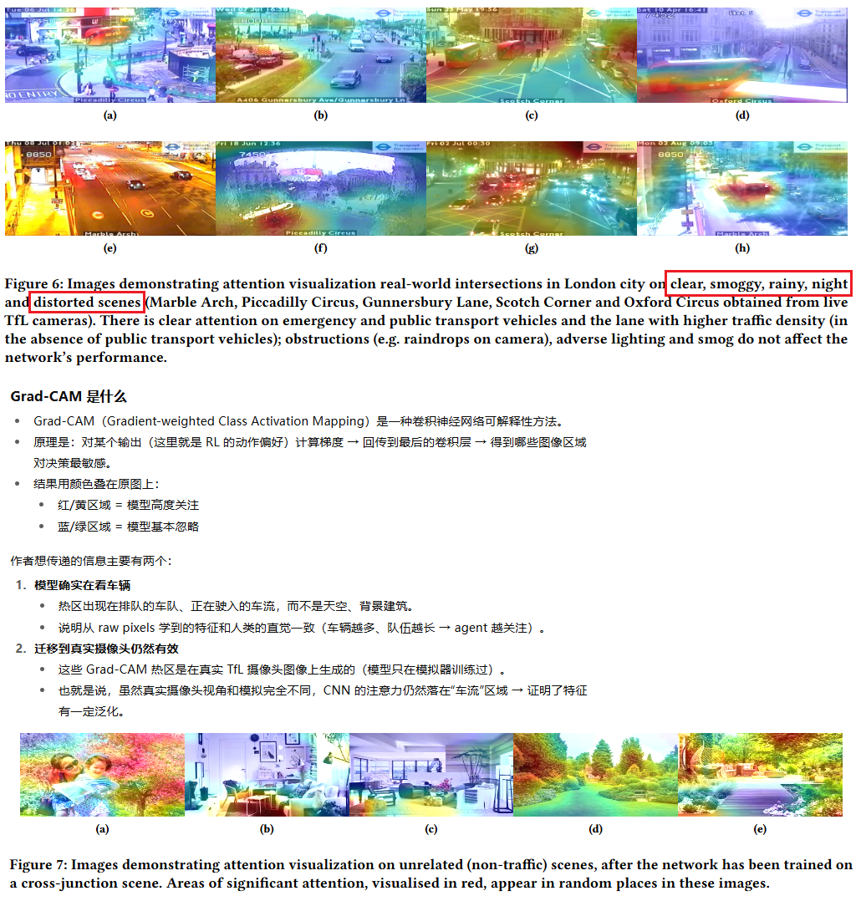

**Fully-Autonomous Vision-based Traffic Signal Control-From Simulation to Reality**

venue: AAMAS

year: 2022

### 1、Introduction

该论文的贡献：

### 2、Related Work

介绍了TSC领域传统的控制方法和RL控制方法的代表性工作

### 3、Preliminaries

介绍了强化学习和基于策略的强化学习

### 4、Method

我们使用Traffic3D模拟器。Traffic3D is a new traffic simulation paradigm, built to push forward research in human-like learning (for example, based on photo-realistic visual input). 

Our agent directly maps RGB images (depicting the prevailing traffic state) to actions (controlling the traffic signals), demonstrating end-to-end learning without any pre-specification of traffic environment features (such as vehicle density, type, etc). 

We define two reward functions: (1) a positive success reward (e.g. +1) for every civil vehicle passing safely through the intersection; and (2) a penalty (e.g. -1) for every civil vehicle waiting at the start of the intersection. 

Besides civil vehicles, we also include emergency vehicles (such as ambulances, police cars and fire-trucks) and public transport vehicles (such as buses) in our experiments. We associate a higher reward of (e.g. +5) for their passing through the intersection and a higher penalty of (e.g. -5) for their waiting at the intersection.

In this work, we use a convolutional neural network (CNN) as CNNs exploit the advantage of spatial coherence in visual data.

Domain randomization has been previously used to successfully transfer simulation-trained RL agents to the real world.In this work, to reduce the reality gap between the simulated and real-world environments, we modify the basic version of our traffic simulation environment to the distribution of many simulations in order to foster effective skill transfer. 

### 6、Experiments

#### 6.1 实验设置

1. 评估指标：交叉口通行时间
2. 比较方法：
   1. 传统标准的控制方法
   2. 传统基于地感的自适应方法
   3. 一种类似论文中方法的DRL方法：基于图像输入，但没有做多样化处理

#### 6.2 实验结果

成功迁移：

### 8、Conclusion

我们提出了一种基于视觉的端到端的训练方法，模型输入的是交通监控画面，不需要人工组织输入特征。经过领域随机化的增强，我们在模拟器上训练的agent可以适应各种情况的真实环境，包括不同的路口拓扑、天气、光照。

在未来：

**多路口 / 多智能体扩展**

- 目前工作主要集中在单路口控制。
- 未来希望扩展到 **multi-agent 设置**：多个路口之间通过视觉输入协作控制，从而适应大规模路网。

**形式化验证与安全性**

- 他们承认现实部署必须要保证安全，不能像仿真里随便探索。
- 提出要做 **formal verification（形式化验证）**，确保即使在极端条件或系统出错时，信号控制仍然满足安全约束（例如避免相位冲突、死锁）。

**更广泛的 Sim→Real 泛化**

- 虽然已经尝试了域随机化，但在一些情况（如雪天）出现负迁移。
- 未来要探索更强的泛化方法（可能包括更丰富的 domain randomization 或 domain adaptation）。

**真实部署与评估**

- 他们暗示下一步要在真实交通信号系统里做真正的闭环测试（不仅仅是 Grad-CAM 可视化）。
- 包括和现有信号控制器集成，在线评估 throughput、travel time 等指标。

### 9、代码开放

无