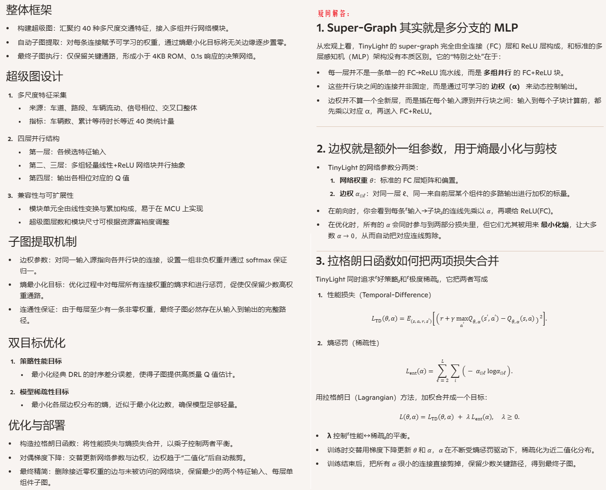
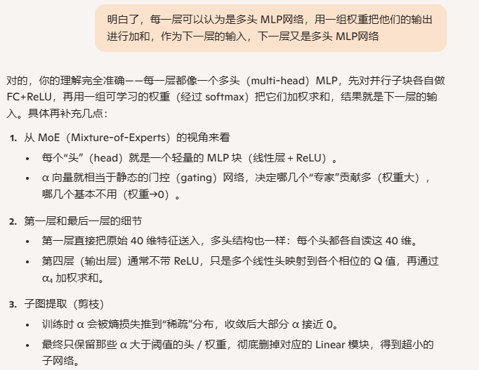
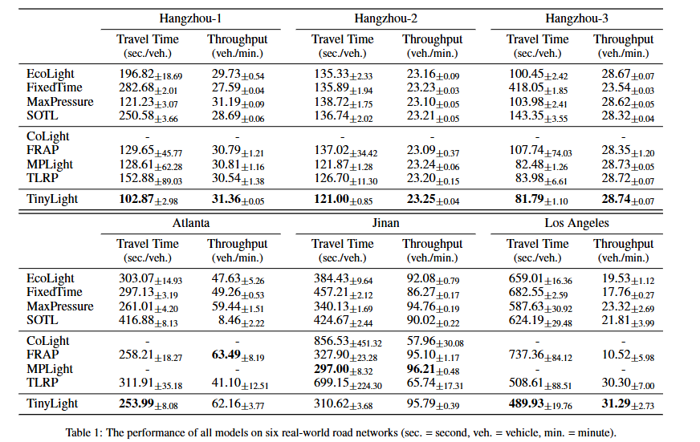
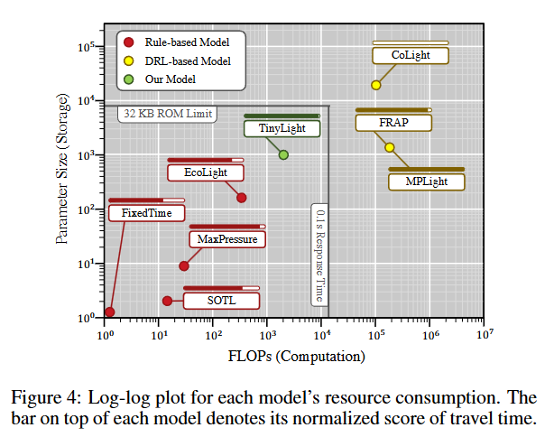
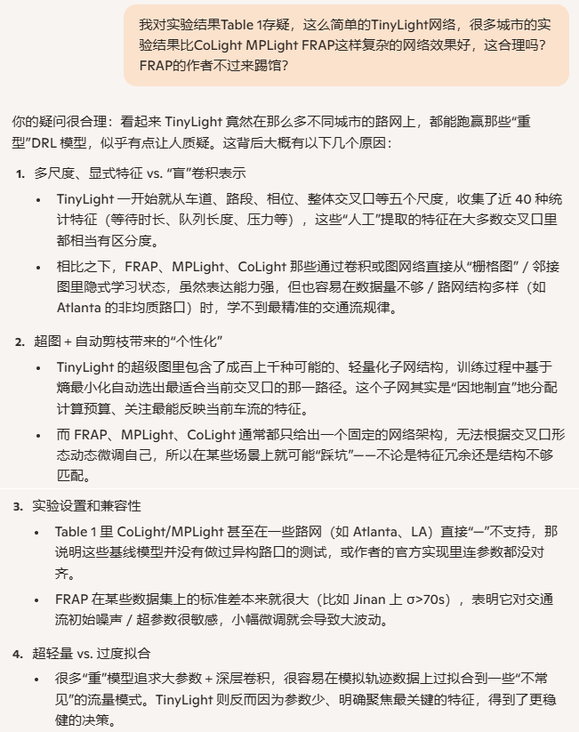

**TinyLight：Adaptive Traffic Signal Control on Devices with Extremely Limited Resources**

venue: IJCAI

year: 2022

### 1、Introduction

据统计，在2019年，美国不足5%的信号灯部署了RL 控制方案，主要的原因就是要求的硬件太昂贵（bison：我觉得更多的是因为升级工作量大。成本其实还好，一个树莓派也才500块人民币）

MCU通常把cpu / 内存 /外设接口都集中到一个芯片上，所以内存只有上百 KB，外部存储也只有1MB左右。

本论文提出一种对硬件资源要求极低的方案：TinyLight，它可以部署在2KB RAM + 32KB ROM + 小于 8MHz主频环境下，性能表现依然很有竞争力。

### 2、Related Work

介绍了行业在DRL控制TSC问题方面的研究工作，以及轻量化部署方面的工作。

### 3、Preliminaries

介绍了TSC问题方面的一些概念，包括相位、movement、road、pressure。

介绍了RL的基本概念

### 4、Method

#### 4.1 TinyLight Model

### 5、Experiments

#### 5.1 实验设置

1. 模拟器：CityFlow
2. 数据集：杭州、亚特兰大、济南、洛杉矶
3. Baseline：EchoLight、FixedTime、 MaxPressure、SOTL、CoLight、FRAP、MPLight、TLRP(TinyLight with Random Path)、TinyLight
4. 评估指标：平均通行时间、吞吐量
5. 资源开销评估：存储和计算量

#### 5.2 实验结果

### 6、Conclusion

1. **首个面向超低资源设备的 DRL ATSC 模型**   TinyLight 是第一个专门为仅有数 KB 存储和中低速 MCU（≈$5）设计的深度强化学习交通信号控制器。
2. **Super-graph + 自动剪枝**   构建一个多分支 super-graph 覆盖各种轻量子网，利用熵最小化目标在训练中自动将无关边权推向零，生成极简子图。
3. **实测效果**   在多组真实路网和交通流上，TinyLight 以不到 4 KB ROM、0.1 s 响应时间达成与大型 DRL 基线相近的性能。
4. **实践价值与可推广性**   解决了 ATSC 在预算紧张场景下的部署难题；其“超图 + 稀疏化”思路可扩展到其它同样对成本或资源敏感的任务。
5. **局限与未来方向**
   1. 目前训练仍依赖通用机群，期望研究可在 MCU 端实现在线或增量重训练。
   2. 聚焦小规模交叉口，针对大规模路网的子图搜索空间更大，需要更高效的剪枝或 NAS 方法。

### 7、开放代码

[这里](https://github.com/dxing-cs/TinyLight)