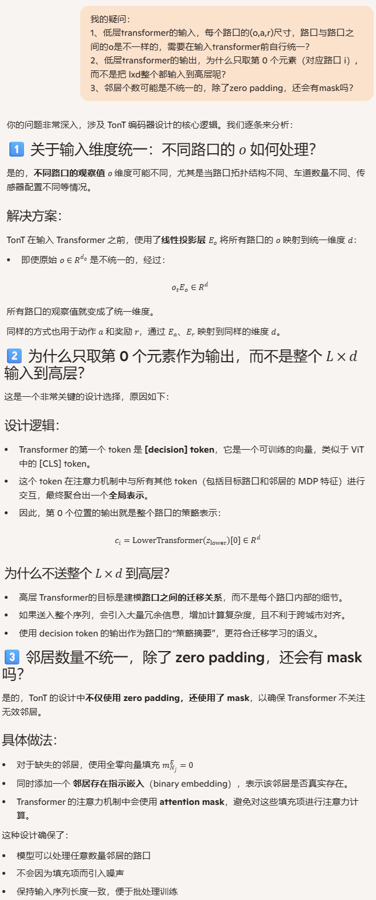

**X-Light-Cross-City Traffic Signal Control Using Transformer on Transformer as Meta Multi-Agent Reinforcement Learner**

venue: IJCAI

year: 2024

### 1、Introduction

在TSC领域，现有的DRL方法都是场景特定的，也就是换一个城市/交叉路口，通常需要重新设计agent并从头训练。

如何跨城市编排众多不同拓扑和交通动态的路口，让DRL方法具备通用性，是一个核心问题。

本论文提出了双层的Transformer on Transformer架构来解决多个路口之间的协同 和 跨城的迁移问题：

1. 下层Transformer需要整的 MDP 信息（o,a,r）来刻画邻居间的因果/关联关系，以提升局部协同
2. 上层Transformer：要实现“跨城市/跨场景的零次（zero-shot）迁移”，不仅需要局部协作能力，还要学到**跨场景的决策动态与任务上下文**（即从历史决策轨迹中推断这个场景当前处于哪种动态、应该用什么风格的策略）。

### 2、Related Work

介绍了TSC领域的 Meta RL方面的工作：

Meta RL-based methods are gaining attention in TSC since they can greatly reduce adaptation costs and have promising performance in new scenarios. 

包括：GeneralLight / AttendLight / MetaLight / GESA / MetaVIM / MetaGAT 

也介绍了Transformer在RL中应用，形成一些解决方案，包括：Decision Transformer / Trajectory Transformer ，他们把RL的决策需求（下一个action）转化为类似NLP中下一个token的预测。还有TransformerLight...

### 3、Method

#### 3.1 overview

#### 3.2 低层Transformer

##### 我的疑问/理解

#### 3.3 高层Transformer

### 4、Experiments

#### 4.1 实验设计

1. 模拟器：SUMO
2. Baseline：FixedTime / MaxPressure / MPLight / IPPO / rMAPPO / CoLight / MetaLight / GESA / MetaGAT 
3. 评估指标：
   1. ATT，we use average trip time as a component of evaluation metrics, defined as the average time for each vehicle from entering the scenario to leaving the scenario. 
   2. ADT：average delay time（bison：这个不好计算啊）

#### 4.2 实验结果

更详细的结果（例如消融实验）见原文

### 5、Conclusion

1. 提出 X‑Light：一种基于 Transformer-on-Transformer 的跨城多智能体交通信号控制框架，包含 Lower Transformer 与 Upper Transformer。
   1. Lower Transformer 聚合目标路口及其邻居的完整 MDP 信息（o, a, r），用于增强路口间协作。
   2. Upper Transformer 利用多时步历史 embedding 和动态预测（pretext task）学习场景无关的决策动态以提升跨场景泛化与迁移能力。
2. 结合多场景共训练（multi-scenario co-training）与残差连接（将目标路口原始观测添加到最终表示），在零样本迁移与常规模型训练两种设置下均取得显著性能提升与训练稳定性。
3. 实验验证：在多种仿真场景上 X‑Light 在零-shot 转移与非转移设置中均优于多种基线方法，展示出更好的传输性和协作效果。

### 我的疑问

训练的时候是两层Transformer和各个城市的路口的数据输入，那训练完后部署到一个路口，还是两层Transformer吗？