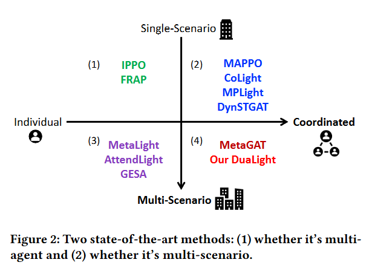
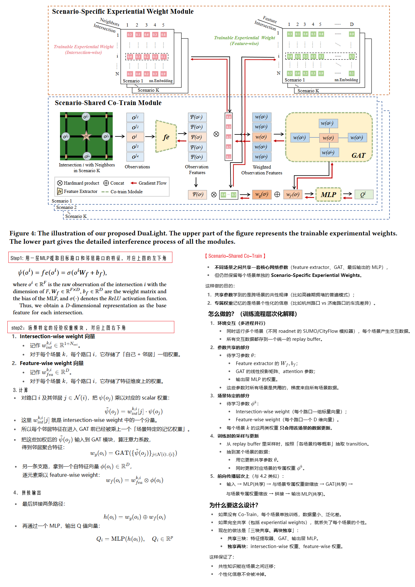
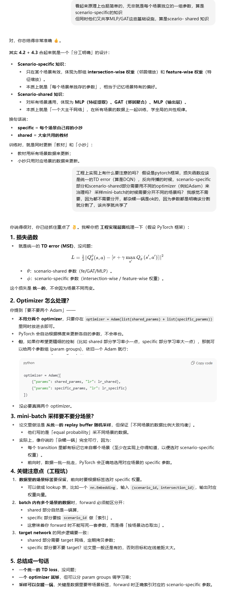
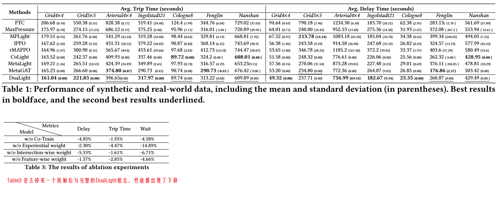

DuaLight-Enhancing Traffic Signal Control by Leveraging Scenario-Specific and Scenario-Shared Knowledge

venue: AAMAS

year: 2024

### 1、Introduction

多路口的协同，有两派做法：

1. 第一派，专注于在一个特定场景（带有多个路口的交通网络）下训练，通常观测中会整合目标路口的状态信息和周边邻居路口的状态信息。这一派通常会过拟合到这个特定的场景，不能很好的迁移和泛化到其他场景。
2. 第二派，跨多个场景训练，通常会有更好的泛化能力来应对不同的城市或者不同的交通网络。他们通常是训练一个agent然后部署到各个交叉路口。这一派忽视了怎样利用每个场景的独特知识来促进路口间的协同。

为了解决这个问题，本论文提出带有两个模块的DualLight方法，一个模块学习跨场景的共性知识，而另外一个模块学习场景针对性知识。

### 2、Related Work

如上图分类，这章节介绍了单场景和多场景下的多种MARL方法

### 3、Problem Definition

介绍了TSC问题中的各种概念和RL的基本概念

### 4、Method

#### 我的理解：

### 5、Expertiments

#### 5.1 实验设计

1. 模拟器：SUMO
2. 数据集：人工合成的数据集 + 科隆/因戈尔施塔特/另外两个中国城市的实际数据
3. 比较方法：
   1. FixedTime
   2. MaxPressure
   3. IPPO
   4. MPLight
   5. MetaLight
   6. rMAPPO
   7. CoLight
   8. MetaGAT
4. 评估指标：平均延时、平均通行时间、平均等待时间

#### 5.2 实验结果

更多的结果见原论文

### 6、Conclusion

**贡献总结**

- 提供了一种新的思路来处理 TSC 的「跨场景知识迁移 + 场景特定优化」。
- 框架通用，可以拓展到更多异构交通场景。

**未来工作**

- 将研究拓展到 **更大规模的真实路网**，比如全市级别的部署。
- 探索 **跨场景知识迁移的更多机制**（不仅仅是 embedding 权重，还可以有 meta-learning 等方式）。
- 考虑 **更复杂的交通因素**（如行人、自行车、特殊事件）。

### 7、代码公开

[在这里](https://github.com/lujiaming-12138/DuaLight)