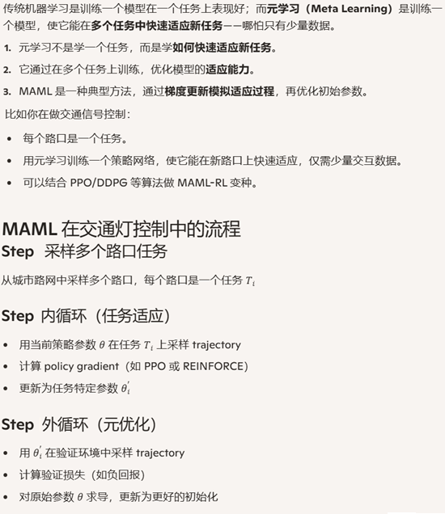
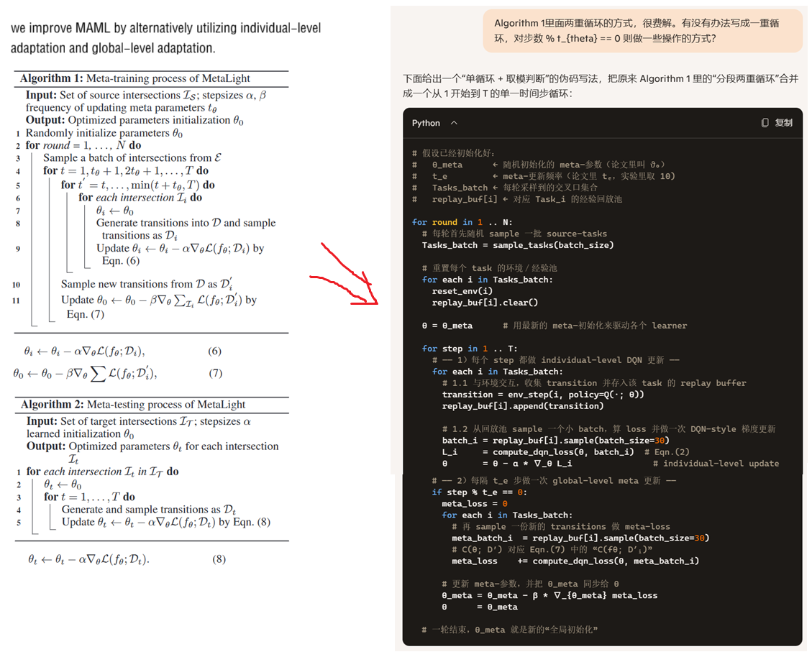
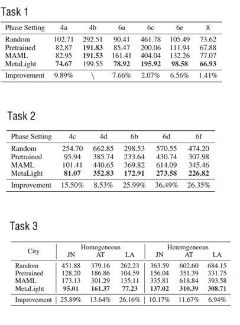

**MetaLight Value-Based Meta-Reinforcement Learning for Traffic Signal Control**

venue：AAAI

year：2020

### 1、Introduction

TSC场景下的DRL训练过程效率比较低，本论文创新的提出了一种方案，把基于policy的meta-learning应用于基于Q网络的TSC场景，主要贡献有：

1. 率先把基于价值网络的meta-RL方法应用于TSC，提高了训练的效率
2. 我们提出的MetaLight，创新性的把个体适应（individual-level adaptation）和全局适应（global-level adaptation）结合起来
3. 我们的方法在四个真实的TSC数据集上表现有效/高效

### 2、Related Work

重点介绍了met-learning和FRAP网络架构。

Meta reinforcement learning aims to solve a new reinforcement learning task by leveraging the experience learned from a set of similar tasks.

However, most gradient-based reinforcement learning algorithms are mainly focusing on policy-based reinforcement learning. How to combine MAML with value-based reinforcement learning is rarely studied.

快速了解一下meta-learning:

以往的TSC DRL方法，缺乏应对不同交叉路口的统一神经网络设计，每面临一个新的交叉路口，都需要从0开始训练agent。而FRAP网络架构，使得对不同的交叉路口使用统一的神经网络设计成为可能。

而我们的方法，MetaLight ，就是把改进的FRAP和扩展的meta-learning结合在一起，实现了不同路口场景下的知识迁移，从而快速的适配新场景。

### 3、Problem Statement

### 4、The MetaLight Framework

[代码在这里](https://github.com/zxsRambo/metalight)

#### 4.1 FRAP++

相比FRAP，FRAP++有两个改进：

1. FRAP把相位内的车道的特征相加，作为该相位的特征，再输入到DQN网络。考虑到不同的路口，或者相同的路口中，不同的相位的车道数量不同，相加会引入不稳定性，所以本论文方法改为对相位下辖的车道特征求均值。
2. FRAP是每个回合更新一次，FRAP++应用于DQN，每一步都更新一个mini-batch

两者相同的地方：

1. 输入特征包括每个车道的车辆数、当前相位
2. 输出动作就是下一个相位
3. 奖励是入口车道平均队伍长度（的负值）

至此，FRAP++变成了一个交叉路口结构无关的网络架构，可以在不同路口上共享网络参数

#### 4.2 MetaLight Framework

### 5、Experiments

实验环境：CityFlow

实验数据集：济南、杭州、亚特兰大、洛杉矶

比较的方法有：

1. Random：随机初始化，从0开始训练FRAP++
2. Pretrained：基于某个交叉路口训练好的模型，在一个新的路口继续训练
3. MAML：MAML+FRAP组合的meta learning
4. SOTL：（Self Organizing Traffic Light Control），一种经典的TSC方法，当入口车道上的等待车辆数超过一定阈值，就切换相位到该车道
5. MetaLight：本论文提出的方法

评价指标：

1. 路口的平均通行时间： This metric is defined as the average travel time that vehicles spend on approaching lanes (in seconds).

涉及到同构异构、相位4a 4b等不同的phase set，图表理解起来有点复杂：

### 6、Conclusion

本论文提出了一种通过迁移已有模型的知识来提高TSC场景下DRL训练效率的方法，创新的使用了FRAP网络架构和meta learning。实验在异构和同构场景下都表明了新方法的有效性。

未来我们计划在下面两个方面继续深入：

1. 把meta learning应用到多个交叉路口的TSC中
2. 尝试解释黑盒的meta learning，搞清楚哪些知识被迁移了

### 7、我的疑问

Q：论文前半部分讲的是要用meta-learning /FRAP++实现知识迁移，从而提高训练的效率，例如基于已经训练好的一个模型在一个新的路口可以很少的样本就训练出对应的agent。 实验部分，为什么只是呈现最后训练的agent可以有更低的路口通行时间，却不是呈现模型收敛速度呢？

A：在 MetaLight 的实验里，作者其实是通过 5、6、7 三组「travel time 随训练时长变化」的曲线来隐式地展现 sample efficiency（也就是收敛速度）的──只不过在最终的表格里，他们只列出了每个方法在训练结束时的平均通行时间，以便一眼对比收敛后质量的绝对差距。

1．曲线里其实有「速度」信息

- 图 5/6/7 横轴就是「simulation seconds」（也可以看成和样本数量成正比的训练步数），纵轴是实时的 average travel time。
- 你可以直接从曲线斜率、以及它们达到某个阈值（比如 200 s）所用的横坐标，去量化「MetaLight 到 200 s 只要 500 s，Random 要 2000 s」之类的收敛速度对比。

2．为什么表里没专门给收敛速度数字？

- 篇幅所限＋真实系统中「最终通行时间」往往比「几步到某个精度」更直观。
- RL 曲线本身波动比较大，直接对比「XXX 秒到达 90% 最终性能」要做更多的统计（比如多 seed 下的均值和方差），会占很大篇幅。
- 作者选择把重点放在「同样的训练预算下，MetaLight 能收敛到更低的通行时间」这一核心结论，并用曲线示例来直观证明“它跑得又快又稳、比随机初始化更少样本就能达到同等或更好效果”。