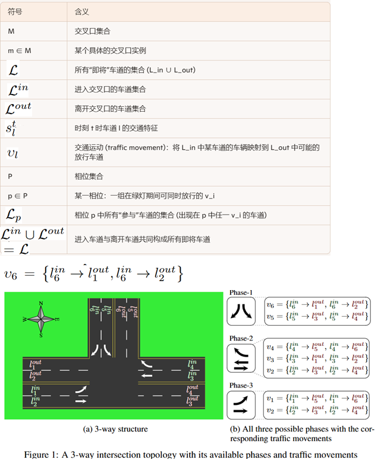
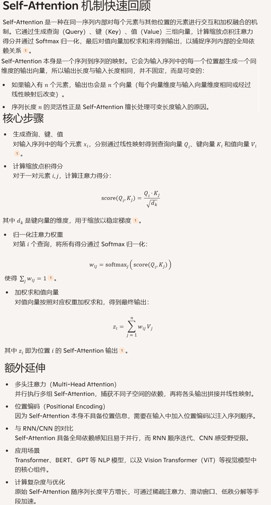
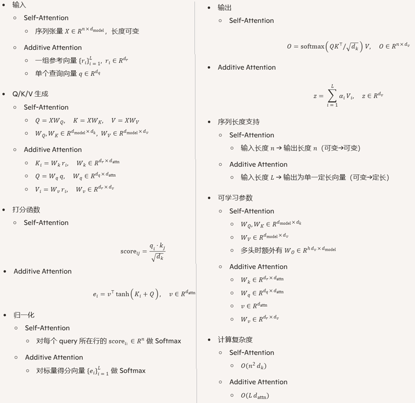
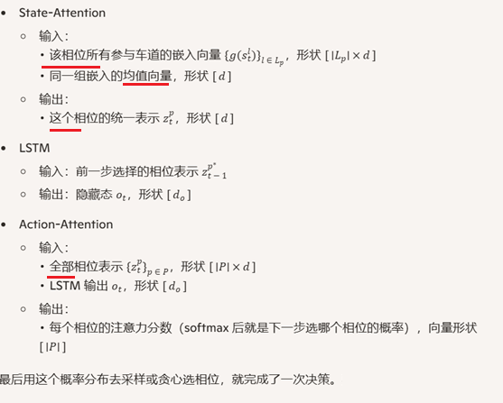
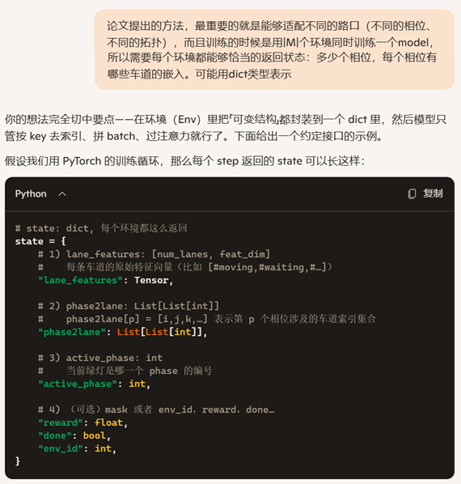
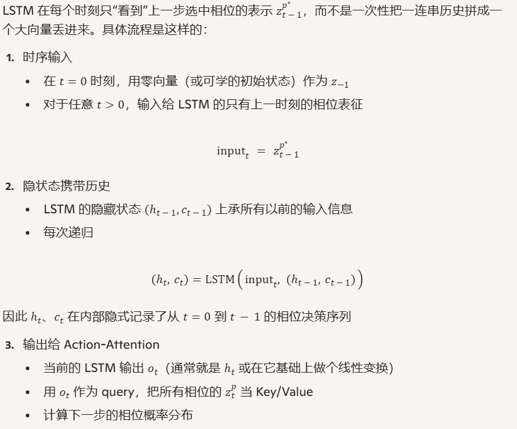
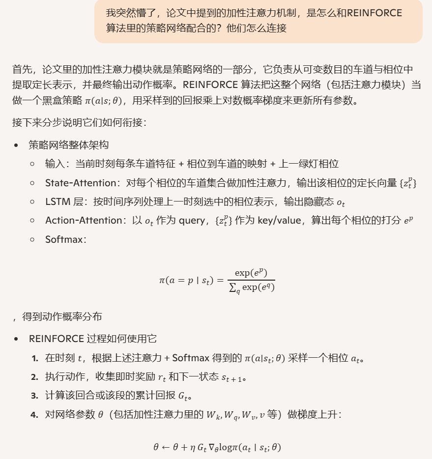
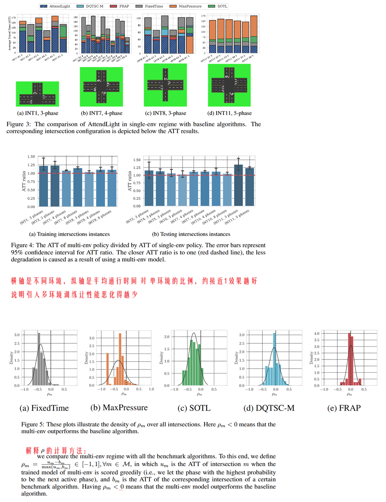

**AttendLight:Universal Attention-Based Reinforcement Learning Model for Traffic Signal Control**

venue:Neural IPS

year:2020

### 1、Introduction

RL解决TSC问题时面临的问题：

需要针对每个新的路口（不同的拓扑或者不同的流量分布）从头设计和训练agent，这对于有数以千计信号灯的城市交通来说是不可行的。虽然已有一些方法使用迁移学习，但还是需要针对每个路口做一些二次训练工作，解决得不彻底。

本论文引入了天然就支持变长输入的注意力机制，来训练可以应用在各种类型路口的通用的RL agent。

### 2、Related Work

介绍了RL解决TSC的各种方案和论文

### 3、Traffic Signal Control Problem

解释了符号，并举例一个具体的场景，可以看出确实每个路口差异明显，常规思路下需要逐个设计和训练agent

### 4、Reinforcement Learning Design

这一章节交代具体的方法设计。论文里没有给出代码

#### 4.1 Attention Mechanism

论文里用到的注意力机制，不是自注意力机制，而是加性注意力机制。

两个注意力机制的区别：

具体到论文里的方法，是这样来使用加性注意力的：

LSTM的理解：

#### 4.3 RL Algorithm

使用了REINFORCE算法

与 所有环境（交叉口的信号灯）交互，采集经验，训练一个agent，然后把它部署到所有的交叉口。

### 5、Numerical Experiments

实验环境：

1. 用了11个不同拓扑结构的路口同时训练，他们有不同的相位和不同的流量分布
2. 流量数据有实际的数据集（杭州和亚特兰大），也有人工生成的
3. 输入的车道特征包括移动的车辆数和等待的车辆数，每个环境运行600s一个回合，每个相位至少10s，不同相位切换中间有5s黄灯
4. 使用cityflow模拟器

用来比较的benchmark有：

1. FixedTime
2. MaxPressure
3. SOTL
4. DQTSC-M：用 Deep Q-Learning（DQN） 方法训练的多环境（Multi-Intersection）版基准算法。DQTSC-M 能“零修改”适配不同拓扑，核心就在于把每个路口的可变结构都映射到同一套“**定长 + mask**”的状态—动作空间，然后用一张共享参数的 Q 网络去处理
5. FRAP
6. AttendLight (本方法)

实验结果：

### 6、Conclusion

本论文创新的提出了一种通用的方法来训练一个agent应对多个不同的交叉路口。在单环境下，该方法超过了多个benchmark方法。在多环境下验证了其通用性和泛化能力。

未来可以在这些方面继续研究：

1. 研究互联的有上下游关系的多个交叉路口
2. 使用不同的RL方法例如PPO、A2C
3. 把attention的思路扩展到TSC以外的其他领域

