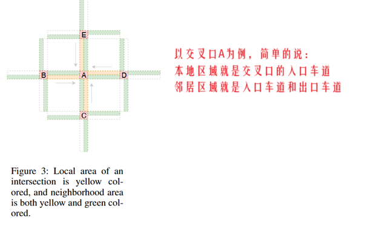
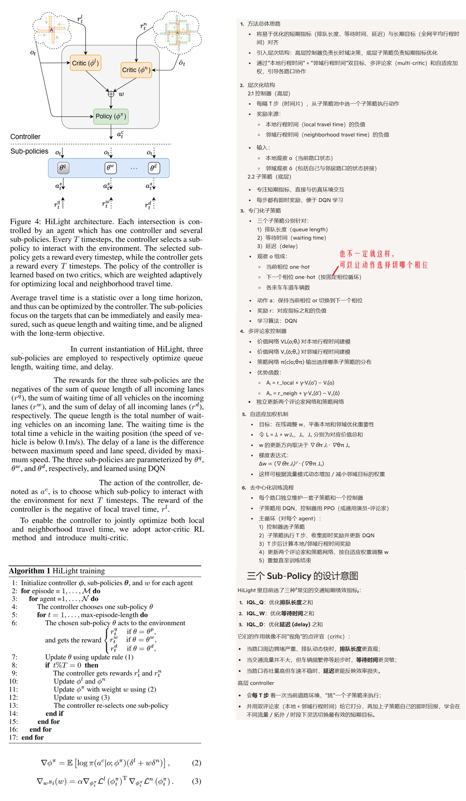
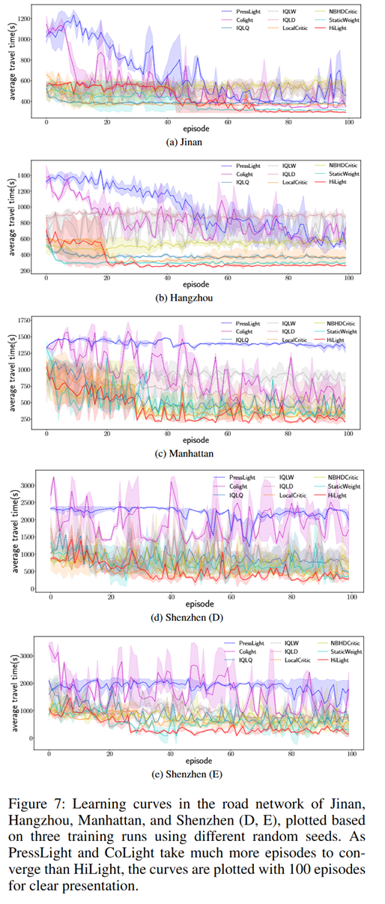

**Hierarchically and Cooperatively Learning Traffic Signal Control**

venue：AAAI

year：2021

### 1、Introduction

RL解决TSC问题的时候，面临两个挑战：

1. RL是最大化奖励/回报，而TSC是最小化ATT（平均通行时间），两者在某些交通状况下可能不一致，导致陷入局部最优
2. 相邻路口间缺失联动和协同，不是全局最优

为了应对上述挑战，本论文提出一种层级式和合作式RL的方案。

### 2、Related Work

介绍了传统方法的TSC、RL的TSC、HRL等

### 3、Preliminaries

介绍了路口的拓扑和相关概念。

**Average travel time** of all vehicles in a road network is the most frequently used measure to evaluate the performance of traffic signal control. However, as it can only be measured over a long time horizon, it is hard to optimize average travel time directly.

**Local travel time** of an intersection is average time vehicles spent on the local area of the intersection, while **neighborhood travel time** is average time vehicles spent on the neighborhood area of the intersection. 如Figure 3 所示

### 4、Method

只要扯到HRL，就会挺复杂的：

### 5、Experiments

实验设计：

1. 模拟器：CityFlow
2. 数据集：四个真实数据集：杭州、深圳、济南、纽约，每个区域有12到33个不等的信号灯
3. baseline：
   1. FixedTime
   2. SOTL
   3. MaxPressure
   4. PressLight
   5. CoLight
   6. IQL: ptimizes queue length, waiting time, or delay at each intersection using DQN, respectively denoted as IQLQ,IQLW,and IQLD, which are the sub-policies of HiLight and used for ablation studies.
   7. LocalCritic :HiLight with only the critic for local travel time
   8. NBHDCritic :HiLight with only the critic for neighborhood travel time
   9. StaticWeight :HiLight with a static w
4. 评价指标：
   1. 平均通行时间
   2. 车辆吞吐量

The travel time of a vehicle is the time span between entering and leaving the road network. 

The throughput is the number of vehicles which have finished their routes over the course of the simulation.

实验结果：

### 6、Conclusion

我们的方法使用HRL来协同多个信号灯，性能超过了其他RL方法

The controller minimizes local travel time and neighborhood travel time jointly with adaptive weighting by selecting among the sub-policies that optimize short-term targets. 

Cooperation among agents is encouraged by the optimization of neighboring travel time.

### 7、开放代码

[这里有开放代码](https://github.com/zhuliwen/RoadnetSZ/tree/main/code/HiLight)