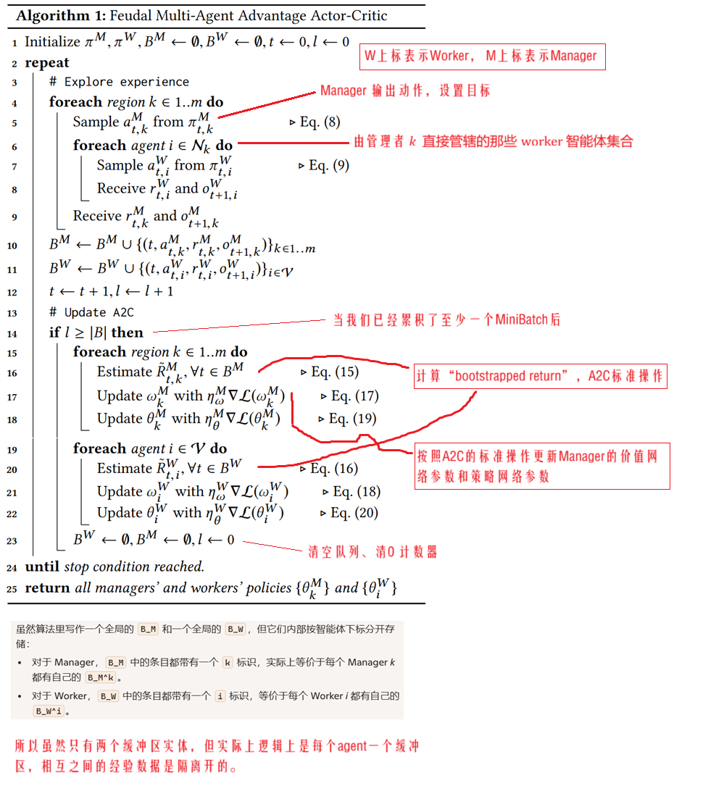
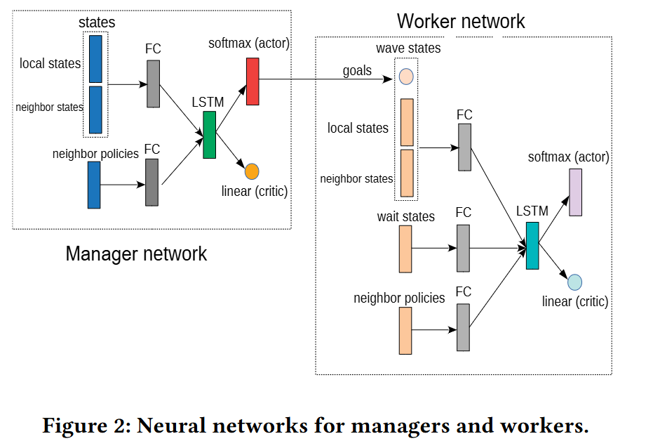
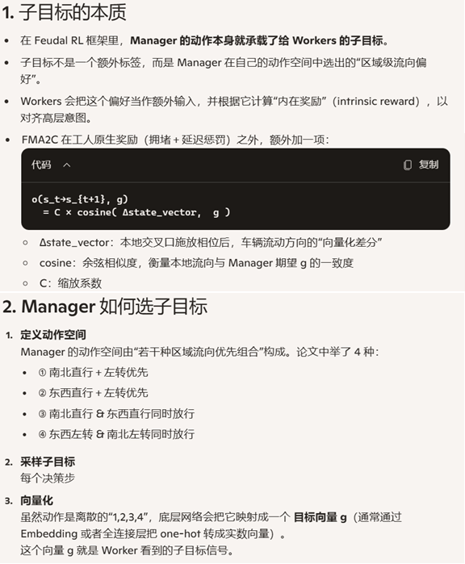
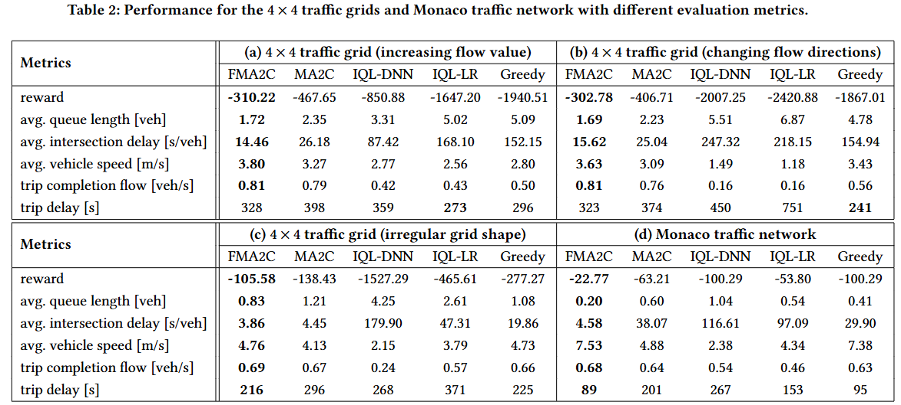

**Feudal Multi-Agent Deep Reinforcement Learning for Traffic Signal Control**

venue：AAMAS	

year：2020

### 1、Introduction

背景问题还是多个路口如何协同达到全局最优的问题。

It is difficult to achieve the global optima when agent only optimizes its own reward based on local observations.

论文把Feudal RL和 MA2C（Multi-agent Advantage Actor-Critic）方法创新性结合起来，提出了FMA2C方法。

FMA2C把交通网络分成多个区域，每个区域由一个Manager和多个Worker agent负责，每个worker负责一个信号灯，manager为worker设置目标。

### 2、Background

介绍了RL、MA2C方法、Feudal RL方法

### 3、Related Work

### 4、FEUDAL MULTI-AGENT ADVANTAGE ACTOR-CRITIC ALGORITHM

#### 4.1 算法

#### 4.2 Worker / Manager 的输入特征和奖励

1. Worker（工人）  
   1.1 输入特征  
   
         1. wave：  交叉口每条来车道上固定距离内的车辆数  
         2. wait：  每条来车道上首辆车的累计等待时长  
         3. 区域内邻居特征 ：将同一区域中相邻工人的 wave 和 wait，按距离系数加权后并入  
         4. 策略指纹：区域内相邻工人上一时刻策略输出的动作概率分布  
         5. 管理者目标  ：来自所属管理者在当前时间步采样的子目标向量  
   
   1.2 即时奖励  
   
         1. 本地惩罚  ：对本交叉口所有来车道的 wave 和 wait 之和取负值  
      2. 邻居奖励加权  ：对同一区域中每个相邻工人的本地惩罚值，按距离系数加权并累加  
         3. 管理者回报共享  ：将所属管理者的即时区域性能值加入到工人的奖励中  
   
2. Manager（管理者）  
   2.1 输入特征  
   
         1. 区域边界车流  ：按北/东/南/西四个方向统计本区域与邻区域交汇处来车道的车辆数  
         2. 邻居管理者特征  ：对相邻管理者的边界车流，按距离系数加权后并入输入  
         3. 策略指纹  ：相邻管理者上一时刻策略输出的动作概率分布  
   
   2.2 即时奖励  
      1. 区域性能  ：累加本区域所有交叉口在一个决策周期内的到达目的地车辆数和道路流畅度  
         2. 邻居奖励加权 ：对相邻管理者的性能值，按距离系数加权并累加  
         3. 最终回报：本区性能与邻区加权性能的组合，用于管理层策略更新  

#### 4.3 神经网络结构

#### 4.4 理解子目标

### 5、Expertiments

实验设置：

1. SUMO模拟器
2. 数据集：几个人工合成的数据外加一个实际的来自摩洛哥城市的数据
3. 比对baseline：
   1. MA2C
   2. IQL-LR
   3. IQL-DNN
   4. 贪心算法：一个**零学习、纯本地贪心**的信号灯控制策略。每个决策时刻，各个交叉口控制器（Worker）仅根据当前观测，快速选出一个“看上去最好的”相位。

实验结果：

### 6、Conclusion

本论文对MA2C算法进行了扩展，引入了Feudal RL，以解决TSC问题里的全局协调需求。

FMA2C算法把整个交通网络分割成多个区域，每个区域一个Manager 和 多个Worker，每个worker管理一个信号灯。

Manager根据更高的视角做出决策，设置子目标并传达给区域内的每个worker。实验显示FMA2C性能显著超越MA2C。

值得注意的是，FMA2C方法是去中心化的，可以平行扩展到更大的交通网络、也可以增加更多层级。

论文提出的这一思想，具有通用性，可以扩展到TSC以外的其他领域。

未来我们还将继续探索如何更优的分割区域、引入更多的实际数据进行测试。