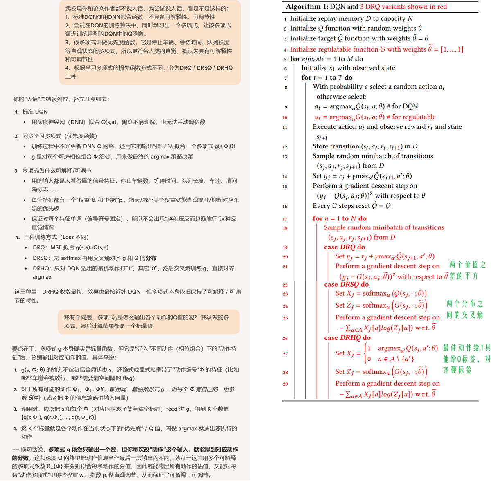
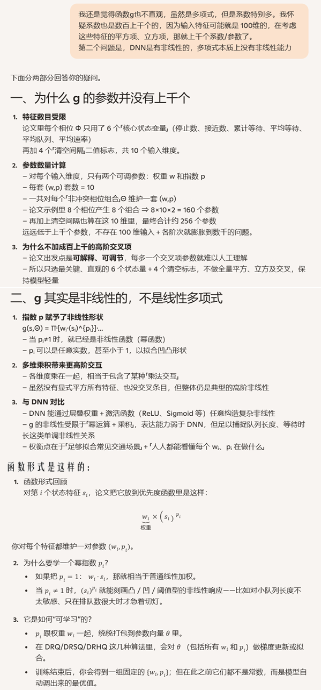
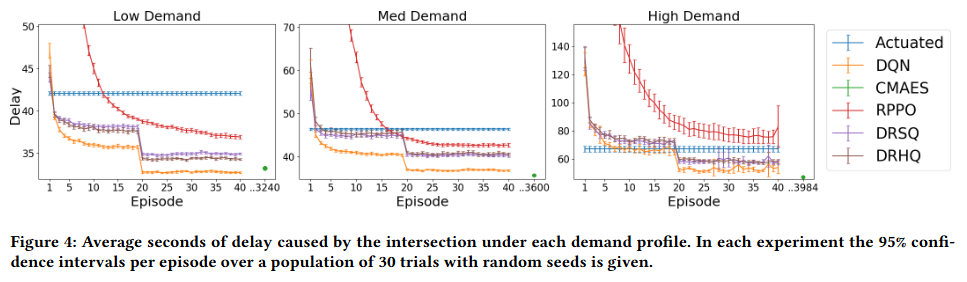

**Learning an Interpretable Traffic Signal Control Policy**

venue: AAMAS

year: 2020

### 1、Introduction

基于DRL的TSC解决方案，缺乏可解释性，这对于涉及到交通安全的信号灯控制是一个挑战。

本论文提出了三个DQN变体，他们有更强的可解释性和可调节性，并测试证明他们有不错的性能。

这三个方法是：

1. Deep Regulatable Q–learning (DRQ), 
2. Deep regulatable softmax Q-learning (DRSQ), 
3. Deep regulatable hardmax Q–learning (DRHQ)

### 2、BACKGROUND AND RELATED WORK

介绍了TSC问题、RL、当前RL在解决TSC问题的时候面临的挑战：不可解释、不好直观调整、需要线上训练导致不安全

### 3、PROBLEM DEFINITION

### 4、EMPIRICAL STUDY

实验环境：

1. SUMO模拟器
2. 数据集：[犹他州的一个数据集](https://udottraffic.utah.gov/ATSPM) 
3. baseline：
   1. Actuated:一种常规部署的交通信号控制算法，也就是目前在真实世界中广泛使用的感应式信号控制器（Actuated Signal Controller）
   2. DQN
   3. CMA-ES：一种基于进化策略的无梯度的优化方法
   4. RPPO：训练PPO算法的时候，和Algorithm 1类似的训练一个可解释的g函数来替代DNN的方式得到的方法，即可调节的PPO。
   5. DRSQ
   6. DRHQ

实验结果：

### 5、SUMMARY AND CONCLUSIONS

论文讨论了可解释可调节的策略函数，这种函数定义了状态变量和动作优先级之间的单调关系。实验发现：

1. 这种策略函数，在学习和拟合最优策略方面，和DNN一样好
2. 在训练可解释的策略函数方面，基于策略梯度的RL方法，不如基于值的RL方法
3. 在使用DQN训练可解释策略函数的三种方法里，DRHQ效果最好