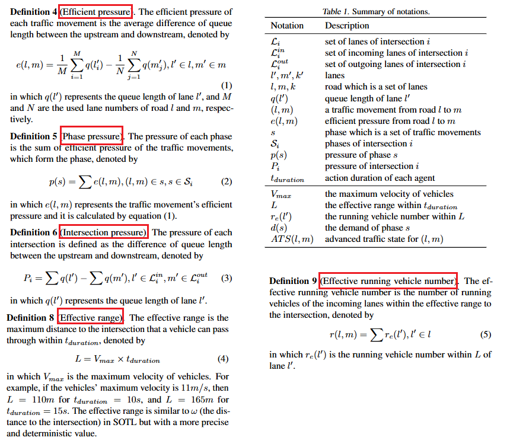
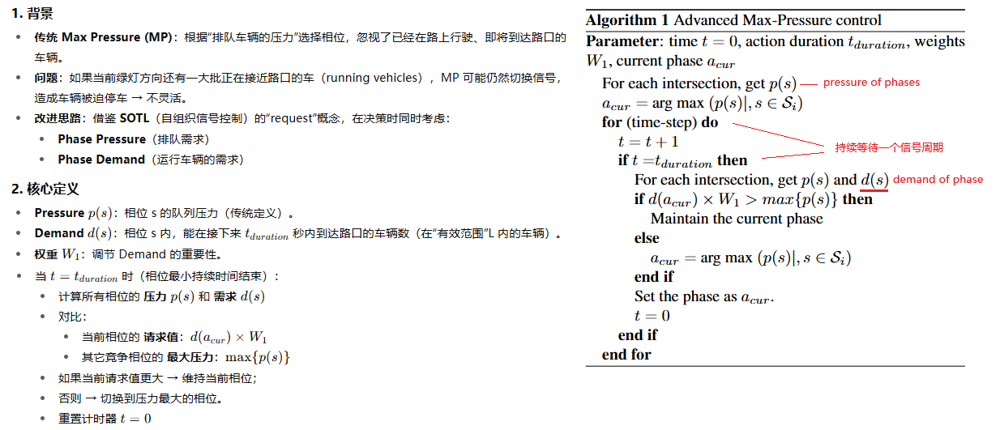
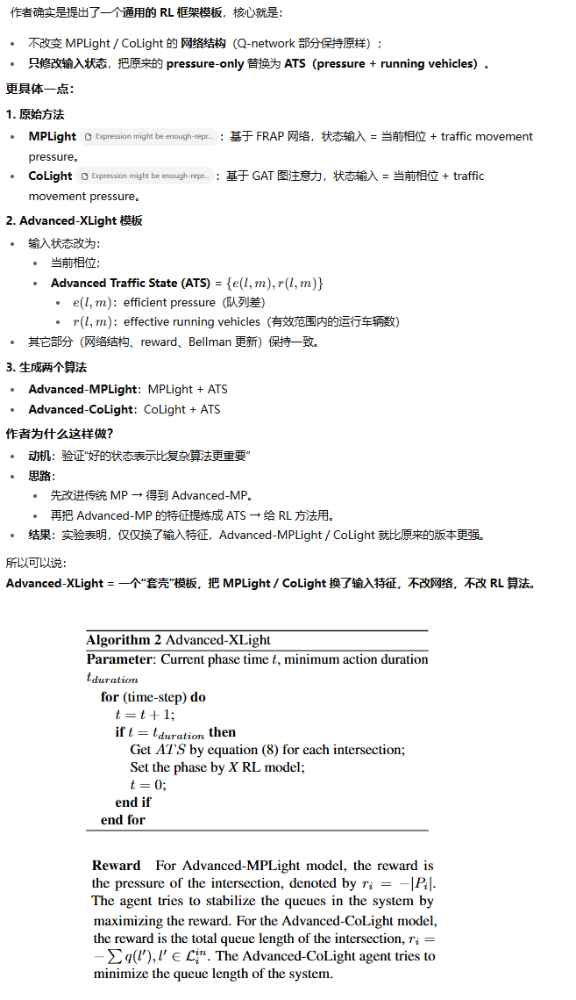
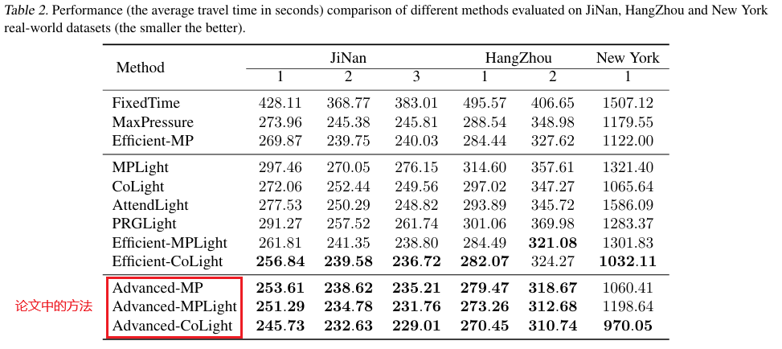
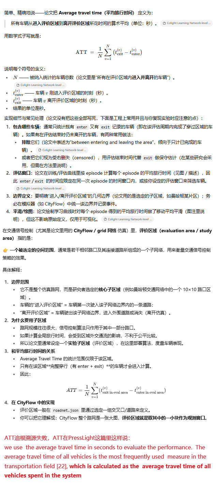
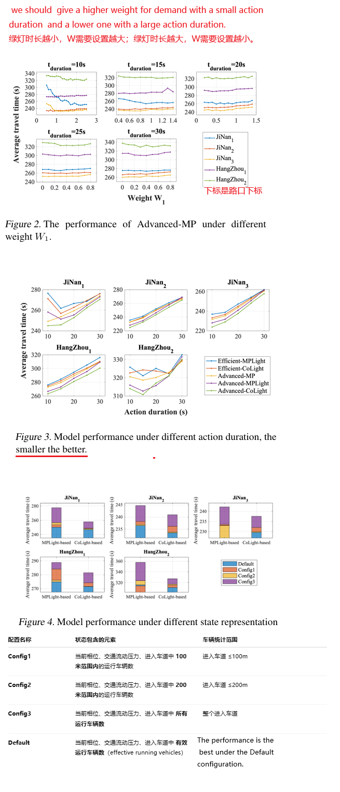
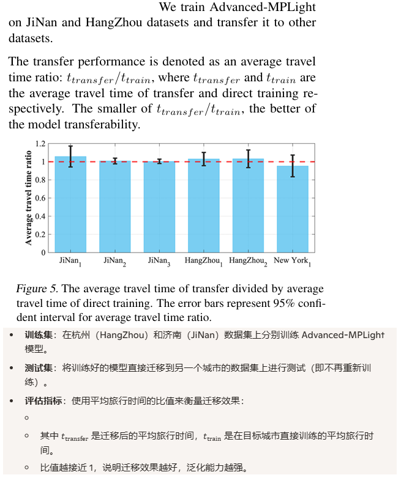

**Expression might be enough-representing pressure and demand for reinforcement learning based traffic signal control**

venue: ICML

year: 2022

### 1、Introduction

这篇论文主要设计并验证了以下几项新东西，以提升大规模交通信号控制的效率与灵活性。

1. Advanced-MP 方法
   1. 在传统最大压强（Max Pressure）策略基础上，同时考虑交叉口内正在通行的车辆和等待队列车辆。
   2. 引入“请求”（request）概念，当积累到一定阈值时触发相位切换决策。
2. 高级交通状态（ATS）
   1. 将压强（pressure）与“有效通行车辆数”结合，构成多维度交通状态表示。
   2. 有效地捕捉不同车流速度和队列长度对相位决策的影响。
3. Advanced-XLight 算法框架
   1. 提供一个通用模板，可将 ATS 嵌入任意强化学习方法。
   2. 基于此模板，衍生出 Advanced-MPLight（基于 Max Pressure）和 Advanced-CoLight（基于图注意力）的两种 RL 算法。
4. 大规模仿真实验与 SOTA 结果
   1. 在多种复杂路网场景下对比，Advanced-MP 与两种 RL 算法均刷新了现有最优性能。
   2. 验证了新状态设计与决策机制在拥堵缓解、通行效率提升上的显著优势。

### 2、Related Work

简单介绍了：

1. 传统TSC方法：FixedTime / MaxPressure / SOTL 
2. RL-based TSC方法：FRAP /  CoLight / PressLight / MPLight / Efficient-CoLight 

### 3 、Preliminaries

给出了TSC问题中的几个概念的清晰定义：

交通网络 / 交通运动流 / 信号相位 / 高效压力 / 相位压力 / 路口压力

并整理了符号表。这部分是论文写得比较严谨和友好的地方。

摘录一下几个不常见的概念：

### 4、Method

#### 4.1 Advanced Max-Pressure

还是一个传统的TSC方法：

#### 4.2 Advanced Traffic State

提出了一种改进的状态表示法，除了当前相位、每个相位的压力，还加上了每个相位的移动中的车辆的信息

#### 4.3 Advanced-XLight 

### 5 、Experiments

#### 5.1 实验设置

1. 模拟环境：CityFlow；每个绿灯后面跟3s黄灯和2s全方向红灯；相位数为4，最小绿灯时长为15s，同Efficient-MP方法；
2. 数据集：来自真实世界的6个路口数据，包括济南（3个路口）、杭州（2个路口）、纽约（1个路口）
3. 评价指标：平均通行时间（ATT）
4. 比较的方法：
   1. FixedTime:固定时间片固定顺序轮转
   2. Max Pressure:  It selects the phase that has the maximum pressure.
   3. Efficient MP: it selects the phase with the maximum efficient pressure
   4. 一系列的RL方法：MPLight / CoLight / AttendLight / PRGLight (使用图神经网络) / Efficient MPLight / Efficient CoLight

#### 5.2 实验结果

#### 5.3 ATT的定义

ATT多次出现，我尝试找到ATT的精确定义和原始出处：

#### 5.4 消融实验

#### 5.5 泛化能力

### 6、Conclusion

This paper proposes a novel method called Advanced-MP, based on MP and SOTL, and designs an advanced traffic state (ATS) for the traffic movement representation with a pressure of queuing and demand of running for vehicles.

In the future, we will analyze more traffic factors and pro vide a more precise traffic state representation to further optimize the TSC methods.