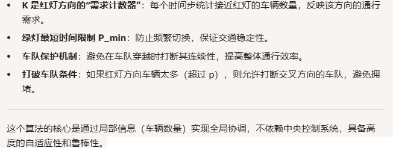

**Self-Organizing Traffic Lights: A Realistic Simulation**

### 1、Introduction

这个就是被反复提及的SOTL算法

算法是这样实现的：

```
初始化：
  对每个相位 i，设置计数器 K[i] = 0
  设置最短绿灯时间 P_min
  设置检测距离 w
  设置打破车队的阈值 p

每个时间步：
  对每个红灯相位 i：
    K[i] += 距离路口 w 范围内、方向 i 上的车辆数量

  当前绿灯相位 j：
    如果 绿灯持续时间 < P_min：
        跳过切换

    如果 路口方向 j 上，距离路口 w 范围内有车辆：
        如果 所有红灯方向的车辆数量 ≤ p：
            跳过切换（车队保护）

    对每个红灯相位 i：
        如果 K[i] ≥ θ：
            切换绿灯到相位 i
            重置所有 K[i] = 0

```

