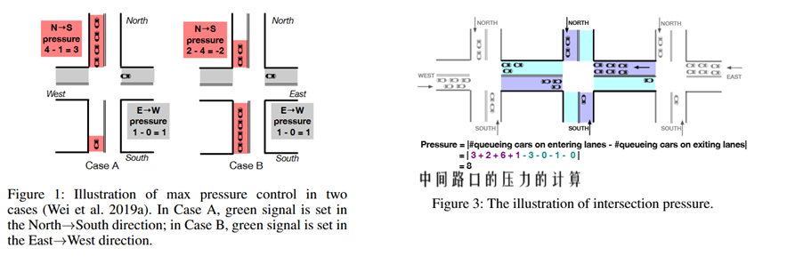
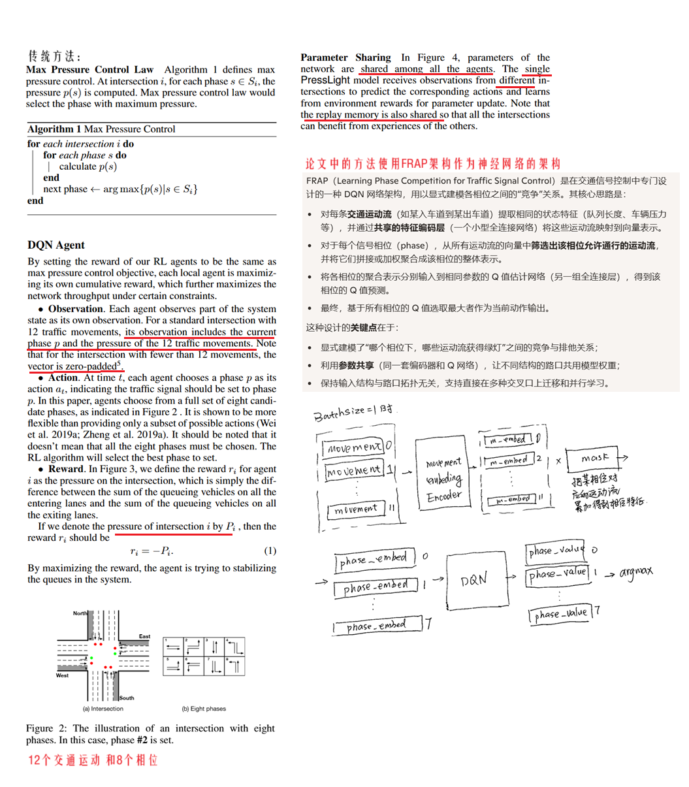
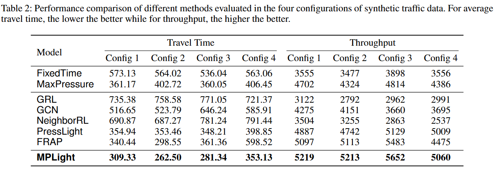
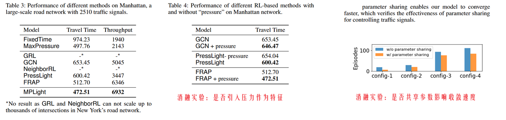

**Toward A Thousand Lights Decentralized Deep Reinforcement Learning for Large-Scale Traffic Signal Control**

venue: AAAI

year: 2020

### 1、Introduction

论文认为要解决三个关键问题：

1. 可扩展性：满足城市级别数千个信号灯的控制需要，满足全局交通优化的需要
2. 可协调性：邻近的信号灯之间能协调，避免相互干扰导致恶化
3. 数据可行性：方法使用到的数据是否可行，方法是否方便实际部署

论文认为该领域前面的工作都不是基于城市级别的全局视野做优化的，不具备扩展性和协调性；一些RL方法想当然认为很详细的交通信息可以轻易获得，实际部署的时候却不可行。

论文建议的方法：

1. 可扩展性：使用FRAP作为基础模型，实现不同结构的交叉口的agent之间也能共享（神经网络的）参数加速训练，从而可以扩展到数千信号灯的城市级规模
2. 可协调性：使用 max pressure理论，agent通过最小化压力，从而最大化交叉口的吞吐
3. 数据可行性：我们的方法只使用简单的现实可行的特征，例如队列长度

### 2、Related Work

以往基于RL的多路口的交通灯控制方法，通常陷入两难的境地：

1. 为了可扩展，一个思路就是孤立的看待每一个路口，这样做带来的问题是缺乏相邻路口的协调性，做不到全局最优。
2. 或者为了协调性，一个替代性思路是中心化的方法，来协调一个区域内多个路口的agent。这样做扩展性又不足

### 3、Preliminaries

定义了 一个相位的压力、一个路口的压力

### 4、Method

作者开源的代码[在这里](https://github.com/Chacha-Chen/MPLight)

论文中提出的方法是这样的：

1. 使用DQN方法进行训练，一个agent对应 所有的交叉路口，所有经验混合在同一个replay buffer里进行训练。一个路口就是一个环境，可以认为是并行 n 个环境训练一个DQN
2. 特征输入：当前相位、12个运动流对应的压力。如果某些路口不足12个运动流，就补0
3. 动作：8个相位对应的8个动作
4. 奖励：路口的压力的负值作为奖励，鼓励agent均衡车辆的分布，最大化路口的吞吐
5. 神经网络的架构采取FRAP架构，输入12个运动流的特征，编码为12个嵌入向量，然后经mask矩阵按照相位进行加权，得到8个相位的嵌入向量，再经过DQN网络，输出每个相位对应的价值，也就是每个动作的价值
6. 论文正文似乎没详细写 current-phase（即环境中绿灯当前是哪一个相位）的接入方式，我理解就一个8个元素的一维向量，one hot方式，与各个相位的嵌入向量拼接后输入到DQN网络就可以

### 5、Expertiments

实验环境：CityFlow，模拟环境 4x4个交叉路口 + OpenStreetMap提供的实际曼哈顿地区的出租车车流数据

compared method：

1. FixedTime
2. MaxPressure
3. GRL
4. GCN：一种graph convolutional neural network
5. PressLight
6. NeighborRL
7. FRAP
8. MPLight（论文中的方法）

评价指标：

1. （路口）平均通过时间
2. 吞吐量

结果：

### 6、Conclusion

我们是第一个在现实数千个交通灯环境下评估的基于RL的TSC方法，显示了强大的性能和通用性。

我们承认在更精巧的协同性 / 邻近路口的配合方面还有更多提升的空间。

### 7、我的疑问

1. 计算路口的压力的时候，或者计算一条运动流的压力的时候，一条入口车道开出来的车，可以去到3条出口车道，那减去的压力值怎么确定？ 【从官方的代码看，一条入口车道只对应一条出口车道，所以没有考虑一辆车开出来后，可能去向的出口车道有三条】
2. 